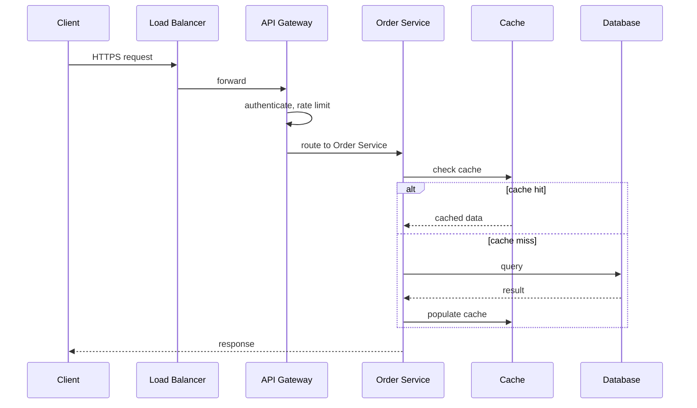
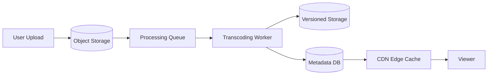
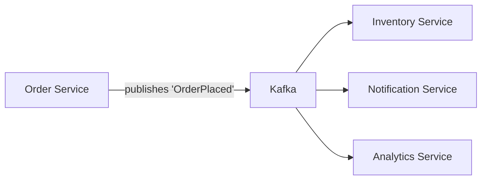
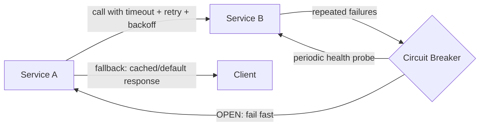
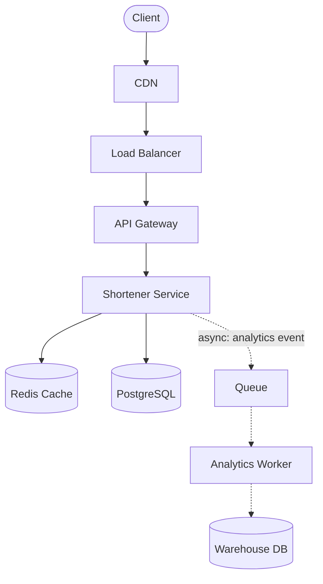

# Chapter 15: How to Draw System Design Diagrams

*← [Chapter 14: Interview Framework](14-Interview-Framework-Communication.md) · [Index](00-Index-and-Assessment.md) · Next → [Chapter 16: Beginner Problems](16-Problems-Beginner.md)*

---

## 15.1 Why Diagramming Skill Is Scored Even Though It's "Just Drawing"

Your diagram is the interviewer's window into how clearly you're thinking. A messy, backtracked-over, unlabeled diagram reads as messy thinking, even if you're saying the right things — and a clean one *creates* an impression of clarity even before you explain it. This is worth deliberately practicing, not treating as an afterthought to "the real content."

**The core habit: build incrementally, left to right, narrating as you go.** Don't draw the whole architecture at once from memory, then explain it — draw the client, say what it does, draw the next box, say what it does, connect them, explain the connection. This mirrors the 10-step framework's pacing and keeps the interviewer following your reasoning in real time instead of catching up to a finished picture.

---

## 15.2 Standard Notation

Use consistent shapes/conventions every time so the interviewer doesn't have to re-learn your visual language mid-interview:

| Component | Typical shape/notation | Label convention |
|---|---|---|
| Client (browser/mobile) | Rounded rectangle or simple icon | "Client" or "Mobile App" |
| CDN | Rectangle, often drawn at the very edge | "CDN (CloudFront)" |
| Load Balancer | Rectangle, sometimes drawn as a diamond/triangle to distinguish it | "LB (ALB)" |
| API Gateway | Rectangle, usually just after the LB | "API Gateway" |
| Service/microservice | Rectangle with a clear name | "Order Service" (never just "Service") |
| Cache | Rectangle, often drawn with a distinct fill/color if you have color available | "Cache (Redis)" |
| Database | Cylinder (the universal DB symbol) | "PostgreSQL (primary)" / "read replica" |
| Queue/Message Broker | Rectangle with a distinct icon (parallel lines are common) | "Kafka" or "SQS" |
| Worker/consumer | Rectangle, usually drawn below/after the queue | "Notification Worker" |
| Object storage | Rectangle or a distinct bucket icon | "S3" |
| External/3rd-party service | Rectangle with a dashed border (signals "not ours") | "Payment Provider (Stripe)" |

**Arrows matter as much as boxes:** a solid arrow for synchronous calls, a dashed arrow for asynchronous/event-driven flow — this single convention lets you show sync vs. async architecture at a glance, which directly demonstrates Chapter 8.2's distinction without needing extra words.

---

## 15.3 The Four Flows You Should Practice Drawing

### Request Flow (synchronous, user-facing)

**What to narrate:** "The client hits the load balancer over HTTPS, which forwards to the API gateway — that's where auth and rate limiting happen before anything touches business logic. The gateway routes to the order service, which checks cache first; on a hit it returns immediately, on a miss it falls through to the database and populates the cache for next time."

### Data Flow (how data moves and is transformed through the system)

**What to narrate:** "A user's upload lands directly in object storage, which triggers a processing job on the queue. A worker picks it up, transcodes it, writes the processed versions back to storage, and records metadata in the database. From there, the CDN serves the processed content to viewers — the original upload path and the serving path are almost entirely decoupled."

### Async Flow (event-driven, decoupled)

**What to narrate:** "Once the order service commits the order, it publishes an 'OrderPlaced' event to Kafka rather than calling each downstream system directly. Inventory, notifications, and analytics each consume independently, at their own pace — if the notification service is down for ten minutes, the order still succeeds, and notifications catch up once it recovers, instead of the whole checkout failing because one non-critical downstream service was briefly unavailable."

### Failure Flow (what happens when something breaks)

**What to narrate:** "If Service B starts failing, Service A's calls are protected by a timeout so they don't hang indefinitely, and retries with backoff handle transient blips. If failures persist past a threshold, the circuit breaker trips open — Service A stops calling B entirely for a cooldown window and falls back to a cached or default response instead of propagating the failure to the client, while the breaker periodically probes B in the background to detect recovery."

---

## 15.4 A Complete Example Interview Diagram (URL Shortener)

Notice: solid arrows for the synchronous read/write path a user's request follows, dashed arrows for the async analytics side-path — one glance tells the interviewer which parts of the system are on the critical path and which aren't, without a single word spoken yet.

---

## 15.5 Practical Tips for Whiteboard/Virtual-Tool Interviews

- **Leave room.** Start your first box in the top-left or far-left, not centered — you will need to add more to the right and below as the design deepens, and running out of space mid-interview to squeeze in a queue you forgot is a real, avoidable problem.
- **Label every arrow that isn't obvious.** "Sync" vs "async," or the actual protocol ("gRPC," "HTTPS"), removes ambiguity the interviewer would otherwise have to ask about.
- **Don't erase — extend.** If a decision changes, it's fine to draw a new box and cross out/annotate the old one rather than erasing history — this actually helps show your evolving reasoning (echoing the "revising a decision openly" excellent-answer pattern from Chapter 14.2).
- **Match diagram detail to the step you're in.** Step 5 (high-level architecture) should be boxes and arrows only — save internal detail (index structure, specific queries) for Step 6's deep dive, drawn as a zoomed-in sub-diagram of just the relevant component, not layered onto the main picture.

---

*Next → [Chapter 16: Beginner System Design Problems](16-Problems-Beginner.md) — fully worked problems starting with URL Shortener, Pastebin, Rate Limiter, and more.*
