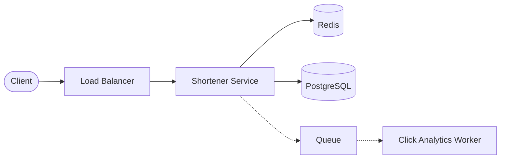
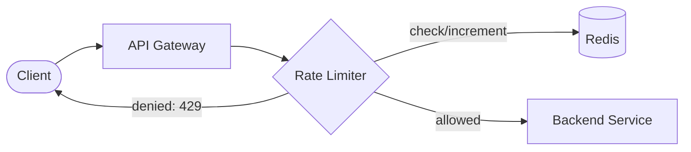
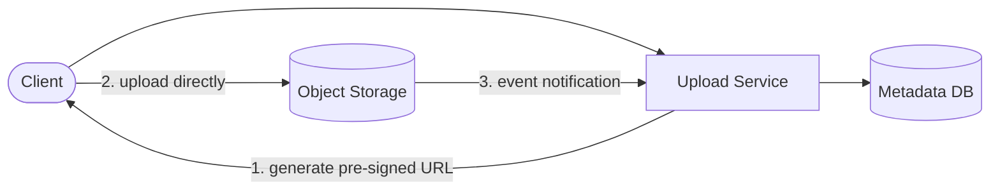
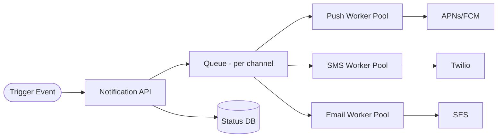
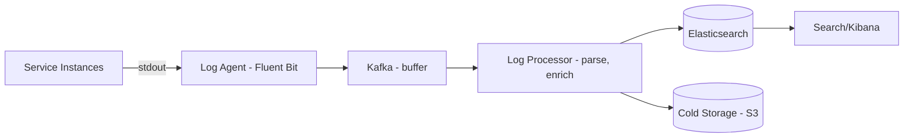

# Chapter 16: System Design Problems — Beginner Tier

*← [Chapter 15: Diagramming Guide](15-Diagramming-Guide.md) · [Index](00-Index-and-Assessment.md) · Next → [Chapter 17: Intermediate Problems](17-Problems-Intermediate.md)*

*Each problem below follows the same 20-point structure so you can pattern-match the shape across problems. Beginner tier means the surface area is small — the goal here is nailing the fundamentals cleanly, not necessarily scale. Use these to drill the [10-step framework](14-Interview-Framework-Communication.md) until it's automatic.*

---

## Problem 1: URL Shortener

**1. Requirements** — FR: shorten a long URL, redirect a short URL to the original, (optional) custom aliases, expiry. NFR: high availability, low-latency redirects (this is on the read-heavy hot path), reasonably durable (a broken short link is a real, visible failure).

**2. Capacity estimation** — From Chapter 3.3, Example 1: ~40 writes/sec avg, ~4,000 reads/sec avg (~12,000 peak), ~9TB storage over 5 years with replication. Read:write ≈ 100:1.

**3. APIs**
```
POST /urls          { long_url, custom_alias?, expiry? } → { short_url }
GET  /{short_code}  → 301/302 redirect to long_url
DELETE /urls/{short_code}
```

**4. Data model**

| Table: `urls` | Type |
|---|---|
| short_code (PK) | varchar(8), indexed |
| long_url | text |
| user_id | FK, nullable |
| created_at, expires_at | timestamp |
| click_count | bigint (or offloaded to analytics) |

**5. Architecture**


**6. Request flow** — Write: client submits long URL → service generates a unique short code (base62 encoding of an auto-incrementing distributed ID, e.g. Snowflake-style — *not* a random hash-and-check-collision loop, which wastes work under load) → persisted to DB → cache populated. Read: service checks cache; on hit, redirects immediately; on miss, reads DB, populates cache, redirects.

**7. Database choice** — Relational (PostgreSQL/MySQL) is entirely sufficient at this data volume (Chapter 3 showed storage is only ~9TB over 5 years) — a key-value store like DynamoDB is a reasonable alternative if you want to never think about DB ops, but isn't *necessary* here, and SQL's simplicity is a fine default.

**8. Cache strategy** — Cache-aside (Chapter 4.5), keyed by short_code. Given a Zipfian access pattern (a small fraction of links get most of the clicks), even a modestly sized cache absorbs the vast majority of read traffic.

**9. Queue strategy** — Not on the critical path; used only to offload click-count/analytics updates asynchronously so incrementing a counter never adds latency to the redirect itself.

**10. Scaling strategy** — Stateless service layer scales horizontally behind the LB trivially. DB scales via read replicas long before sharding is ever needed at this volume; if ID generation becomes a bottleneck, shard the ID generator itself (reserved ID ranges per node, Twitter Snowflake-style).

**11. Failure handling** — Cache down → fall through to DB (degraded latency, not degraded correctness). DB primary down → promote a replica (Multi-AZ automated failover). Redirect service down → LB routes around unhealthy instances.

**12. Consistency** — Eventual consistency is fine for click counts; the URL mapping itself needs to be immediately consistent right after creation (a user creating a link and immediately sharing it must have it resolve correctly) — served correctly by reading from the leader right after a write, or simply because cache-population happens synchronously on write.

**13. Security** — Rate-limit URL creation per user/IP to prevent abuse (spam link generation). Validate/sanitize submitted URLs to prevent open-redirect abuse (a shortener redirecting to a malicious phishing page is a known abuse vector) — consider a malicious-URL blocklist check (e.g., Google Safe Browsing API) at creation time.

**14. Observability** — Track redirect latency (p50/p99), cache hit ratio, creation rate, and 404 rate (expired/invalid codes) as core dashboards.

**15. Bottlenecks** — The ID-generation step if centralized and naive; fixed by pre-reserved ID ranges per app instance. A single hot short link (a viral link) can create a hot key in cache — mitigated with local in-process caching of the very hottest keys (Chapter 4.5).

**16. Trade-offs** — Sequential/encoded IDs (simpler, no collision-checking) vs. random codes (better if predictability/enumeration is a concern) — a real product-security trade-off worth naming (Chapter 14.3's staff-level example).

**17–19. Follow-ups, challenges, and answers**

| Interviewer challenge | Ideal answer |
|---|---|
| "What if two requests try to create the same custom alias simultaneously?" | "A unique constraint on `short_code` at the database level is the actual source of truth — the app can check first for a fast-path UX response, but the DB constraint is what prevents a race condition from creating a duplicate, since the check-then-insert in application code alone isn't atomic." |
| "How would you handle expiring links at scale?" | "Rather than a query scanning for expired rows constantly, I'd either check `expires_at` lazily at read time (fail the redirect if expired, and lazily clean up) or run a low-priority background job that batches deletes of expired rows off-peak — avoiding a single expensive sweep." |

**20. 45-minute version** — Spend real time on: requirements (2 min), capacity (3 min), the ID-generation design decision (this is the one genuinely interesting technical problem here — spend 8–10 min), cache-aside architecture (5 min), and bottlenecks/trade-offs (5 min). Don't over-invest in the data model — it's genuinely simple here.

---

## Problem 2: Pastebin

Structurally very similar to the URL Shortener — worth explicitly noting that similarity in an interview, which shows pattern recognition rather than treating every problem as unrelated.

**1. Requirements** — FR: submit a text/code snippet, get a shareable link, view a snippet, (optional) expiry, syntax highlighting, private/public visibility. NFR: durability matters more here than for a URL shortener (the *content itself* is the product, not just a pointer), reasonable read latency.

**2. Capacity estimation** — Assume 1M new pastes/day, average paste size 10KB, read:write ≈ 10:1 (lower than URL shorteners — pastes are shared more narrowly). Storage: 1M × 10KB/day ≈ 10GB/day raw → manageable, but large pastes (up to a few MB, if allowed) push you toward object storage rather than inline DB storage.

**3. APIs**
```
POST /pastes      { content, expiry?, visibility? } → { paste_id, url }
GET  /pastes/{id} → { content, created_at, expires_at }
```

**4. Data model** — `pastes` table: `paste_id` (PK), `s3_key` (pointer to content if large), `inline_content` (if small — a size threshold decides which), `created_at`, `expires_at`, `visibility`.

**5. Architecture** — Same shape as URL Shortener, with one key addition: **large content goes to object storage (S3), not the database** — the DB stores only metadata + a pointer, exactly like Chapter 3.3's Dropbox example. Small pastes (below a size threshold, e.g., 10KB) can be stored inline in the DB to avoid an extra network hop for the common case.

**6. Request flow** — Write: generate a unique ID (same base62 approach) → if content exceeds the inline threshold, upload to S3 first, then write metadata + S3 key to DB; else write inline. Read: fetch metadata; if inline, return directly; if S3-backed, fetch from S3 (optionally via a CDN in front of S3 for popular public pastes).

**7. Database choice** — Same reasoning as URL Shortener for metadata (relational is fine); the real decision here is the **metadata/blob split** based on size, which is the interesting design point interviewers are checking for.

**8–16.** Cache/queue/scaling/failure/consistency/security/observability/bottlenecks/trade-offs largely mirror the URL Shortener, with one addition: **security** needs explicit content moderation/abuse consideration (pastebins are a known vector for malware/leaked-credential dumps) — mention rate limiting creation, and optionally automated scanning for known-malicious content patterns.

**17–19. Follow-ups**

| Interviewer challenge | Ideal answer |
|---|---|
| "How do you decide the inline-vs-S3 threshold?" | "Based on typical row size economics — keeping most rows small keeps the DB's working set cache-friendly and index-efficient; anything that would bloat row size and hurt buffer-cache hit rate for the *common* small-paste case should go to object storage instead, even though it costs an extra network hop for the minority of large pastes." |

**20. 45-minute version** — Spend the differentiated time on the metadata/blob split reasoning (this is what separates this problem from URL Shortener) — everything else can move quickly by explicitly saying "this part is structurally the same as a URL shortener's approach."

---

## Problem 3: Rate Limiter

**1. Requirements** — FR: limit the number of requests a client can make in a given time window, return a clear rejection (429) with retry guidance when exceeded. NFR: the limiter itself must be extremely low-latency (it sits on the hot path of every request) and must not become a single point of failure for the whole system.

**2. Capacity estimation** — The rate limiter must handle *at least* the full incoming request volume of whatever it's protecting — so its own throughput ceiling needs headroom above your system's peak RPS (Chapter 3).

**3. APIs** — Usually not a public API; it's a library/middleware or a sidecar. Conceptually: `check(client_id) → allow | deny`.

**4. Data model** — A counter per `(client_id, window)`, typically stored in Redis: `rate_limit:{client_id}:{window}` → count, with a TTL matching the window.

**5. Architecture**


**6. Request flow** — Every request hits the gateway; the gateway calls the rate limiter, which atomically checks-and-increments a counter in Redis (via `INCR` + `EXPIRE`, or a single Lua script for true atomicity — this matters, since a naive read-then-write is a race condition under concurrent requests); allowed requests proceed, denied ones get `429` immediately without touching backend services at all.

**7. Database choice** — Redis, specifically for its atomic increment operations and TTL support — this is close to the canonical Redis use case.

**8. Algorithm choice** — This *is* the deep-dive: token bucket (allows bursts, Chapter 13.2) vs. sliding window (smoother, more precise, slightly more expensive to compute) vs. fixed window (simplest, but allows a 2x burst at window boundaries). For most public APIs, token bucket or sliding-window-counter is the right default.

**9. Queue strategy** — Not applicable — this is a synchronous, latency-critical check.

**10. Scaling strategy** — The limiter itself scales by scaling Redis (cluster mode, sharded by client_id) and by keeping the check-and-increment operation atomic and cheap (a single round trip). For extreme scale, consider **local, approximate rate limiting** at each gateway instance (each instance tracks a local slice of the limit, occasionally syncing) to avoid every single request needing a Redis round-trip — trading perfect precision for lower latency and less Redis load.

**11. Failure handling** — If Redis is unreachable, decide explicitly (and say so out loud in an interview): **fail open** (allow the request — prioritizes availability, risks abuse during the outage) or **fail closed** (deny the request — prioritizes protection, risks blocking all legitimate traffic during a Redis blip). Most systems fail open for rate limiting specifically, since the alternative (a Redis blip taking down all traffic) is usually worse than briefly under-enforcing limits.

**12. Consistency** — Distributed rate limiting across multiple gateway instances sharing one Redis is naturally consistent (single source of truth); the local-approximate variant above trades this away deliberately for performance, which is exactly the kind of trade-off worth naming unprompted.

**13. Security** — The rate limiter *is* a security control (mitigating brute-force and DDoS-style abuse) — worth stating this framing explicitly, and pairing it with a WAF (Chapter 10) for defense in depth rather than relying on rate limiting alone.

**14. Observability** — Track rejection rate per client (spotting abuse patterns) and limiter latency itself (it must never become the bottleneck it was built to prevent).

**15. Bottlenecks** — Redis becoming a hot spot for extremely high-traffic clients (a single client_id key gets hammered) — mitigated by the local-approximate approach above, or sharding very hot clients across multiple counter keys.

**16. Trade-offs** — Precision vs. latency (exact global counting requires a Redis round trip per request; local approximation is faster but less precise) — this is the single trade-off to anchor the whole answer around.

**17–19. Follow-ups**

| Interviewer challenge | Ideal answer |
|---|---|
| "How would you rate-limit per-user AND globally at the same time?" | "Two independent checks, both must pass — a per-user key and a global key, both checked (ideally in one Lua script for atomicity) before allowing the request through. I'd also consider tiered limits — e.g., authenticated users get a higher limit than anonymous ones, keyed differently." |

**20. 45-minute version** — This problem's entire value is in the algorithm deep-dive (token bucket vs. sliding window) and the fail-open/fail-closed trade-off — spend 15+ of your 45 minutes there; the surrounding architecture is minimal.

---

## Problem 4: File Upload System

**1. Requirements** — FR: upload a file (potentially large — up to GBs), download it later, list a user's files. NFR: must handle large files without timing out or loading the whole file into app-server memory, resumable uploads are a strong plus, durability is critical (losing an uploaded file is a serious failure).

**2. Capacity estimation** — Depends heavily on use case; assume 1M uploads/day, average 20MB → 20TB/day ingress. This volume alone rules out routing file bytes through your own application servers as a sustainable design.

**3. APIs**
```
POST /uploads/init      { filename, size, content_type } → { upload_url, upload_id }
PUT  {upload_url}        (direct upload, often multi-part, straight to object storage)
POST /uploads/{id}/complete
GET  /files/{id}         → download URL or redirect
```

**5. Architecture — the key design decision: pre-signed URLs**


**6. Request flow** — The client asks the upload service for a **pre-signed URL** (a time-limited, scoped credential letting the client upload directly to S3 without the bytes ever passing through your application servers). The client uploads directly to object storage. Once complete, S3 fires an event (or the client calls a "complete" endpoint) that the upload service uses to record metadata in the database. **This is the single most important design decision in this problem** — routing large file bytes through your own compute layer instead of direct-to-storage is a common beginner mistake that doesn't scale.

**7. Database choice** — Relational or document DB for metadata only (filename, owner, size, storage key, status) — never for the file bytes themselves.

**8. Cache strategy** — Cache metadata lookups (file listing pages); the files themselves are typically served via CDN if frequently accessed, or directly from object storage with pre-signed download URLs for private content.

**9. Queue strategy** — Post-upload processing (virus scanning, thumbnail generation, transcoding) is triggered asynchronously via the S3 event → queue → worker pattern, decoupling upload completion from any processing latency.

**10. Scaling strategy** — Trivial for the upload service itself (stateless, and it's not even in the data path); object storage scales essentially without bound; the metadata DB scales via the same ladder as any other DB (Chapter 5.5).

**11. Failure handling** — Resumable/multi-part uploads (S3's multipart upload API) so a large upload interrupted partway doesn't have to restart from zero. If the "complete" callback is missed, a reconciliation job comparing S3 objects against DB records catches orphaned uploads.

**12. Consistency** — Metadata should reflect upload completion accurately — using S3 event notifications (rather than trusting only a client-side "I'm done" call, which the client might never send if it crashes) makes this authoritative and robust.

**13. Security** — Pre-signed URLs are time-limited and scoped to exactly one object/operation — never issue broad, long-lived write access. Virus/malware scanning on upload completion before making a file available for others to download. Access control on downloads (private files need authorization checks, not just an unguessable URL).

**14. Observability** — Upload success/failure rate, upload duration distribution (especially for large files), storage growth rate.

**15. Bottlenecks** — If bytes were routed through app servers (the anti-pattern) — direct-to-storage upload avoids this entirely, which is exactly why it's the right answer.

**16. Trade-offs** — Direct-to-storage uploads reduce control over the upload (you can't inspect bytes mid-stream as easily) — mitigated by post-upload async scanning rather than inline inspection.

**17–19. Follow-ups**

| Interviewer challenge | Ideal answer |
|---|---|
| "How do you prevent someone from using a pre-signed URL to upload something malicious or oversized?" | "Scope the pre-signed URL tightly — content-type and max-size constraints can be embedded in the signed policy itself (S3 supports this), so S3 rejects a mismatched upload before it even completes. Post-upload async virus scanning is still the safety net for content-level threats a size/type check can't catch." |

**20. 45-minute version** — The pre-signed-URL direct-to-storage pattern is the entire point of this problem — establish it early (within the first 15 minutes) and spend remaining time on post-processing (queue/worker pattern) and resumability.

---

## Problem 5: Notification Service

**1. Requirements** — FR: send notifications via multiple channels (push, SMS, email), support templated content, support both triggered (single event) and broadcast (millions at once) sends. NFR: must absorb massive fan-out bursts without falling over (Chapter 3.3, Example 9), must respect each downstream provider's own rate limits, delivery isn't always guaranteed instantly but shouldn't be silently lost.

**2. Capacity estimation** — From Chapter 3.3: steady state ~5,800/sec, broadcast bursts to millions within minutes — the burst, not the average, is the real design driver.

**3. APIs**
```
POST /notifications  { user_id | segment, channel, template_id, data } → { notification_id, status }
GET  /notifications/{id}/status
```

**4. Data model** — `notifications` (id, user_id, channel, template_id, status, created_at, sent_at), `user_preferences` (opt-in/out per channel), `templates`.

**5. Architecture**


**6. Request flow** — A trigger (order placed, or a broadcast campaign) calls the notification API, which resolves the target user(s) and preferences, then enqueues a job per (user, channel) onto a **channel-specific queue** (separating push/SMS/email lets each worker pool scale and rate-limit independently against its own provider's constraints). Workers pull from their queue, call the provider API, and update delivery status.

**7. Database choice** — Relational for status tracking and templates (moderate volume, needs consistency for "did this actually send"); consider a wide-column store if notification history volume itself becomes very large over time.

**8. Cache strategy** — Cache user notification preferences and resolved templates (read far more often than they change).

**9. Queue strategy** — The core of this design — per-channel queues absorb burst traffic and let each channel's worker pool scale and rate-limit independently, since each provider (APNs, Twilio, SES) has its own throughput ceiling that has nothing to do with the others.

**10. Scaling strategy** — Worker pools scale horizontally per channel based on queue depth (a standard autoscaling-on-queue-depth pattern) — this is the direct fix for the burst problem from the capacity estimate.

**11. Failure handling** — Per-notification retry with backoff for transient provider failures; a DLQ for permanently failing sends (Chapter 7.2); circuit breaker per provider so one provider's outage doesn't stall workers that could otherwise keep processing (though in this case, since each channel has dedicated workers, this is naturally somewhat isolated already).

**12. Consistency** — Eventual — "notification sent" status catches up asynchronously as workers process the queue; this is an acceptable and expected trade-off for this domain, worth stating explicitly.

**13. Security** — Respect user opt-out/consent (a real compliance requirement, not just a UX nicety) — check preferences before enqueueing, not just before actually sending, to avoid wasted work and compliance risk both.

**14. Observability** — Queue depth per channel (the single most important operational metric here — rising queue depth during a broadcast is expected and fine as long as it's draining, not growing unbounded), delivery success rate per provider, end-to-end delivery latency.

**15. Bottlenecks** — A single provider's rate limit during a mass broadcast — mitigated by the per-channel queue design plus worker-side self-throttling matched to the provider's documented limits.

**16. Trade-offs** — Eventual delivery (queued, asynchronous) vs. a hypothetical synchronous "wait until sent" API — async is almost always right here, since notifications are inherently a background concern from the triggering system's point of view.

**17–19. Follow-ups**

| Interviewer challenge | Ideal answer |
|---|---|
| "A marketing campaign needs to notify 50M users in the next hour, but your SMS provider caps at 100 requests/sec. What do you do?" | "50M in an hour needs ~13,900/sec, way above the 100/sec SMS cap — so I'd tell the business this specific channel physically cannot hit that timeline, and either extend the window (50M / 100/sec ≈ 139 hours) or reduce scope. The system's job is to correctly throttle to the provider's real limit and communicate an honest completion estimate, not to pretend a rate limit doesn't exist — I'd also suggest push notifications as the higher-throughput channel for a broadcast like this if acceptable." |

**20. 45-minute version** — Spend the majority of time on the queue-per-channel design and the burst/backpressure story (Chapter 6.3) — that's the entire differentiated challenge in this problem; the CRUD-like status tracking is secondary.

---

## Problem 6: Logging System

**1. Requirements** — FR: collect logs from many services, make them searchable, support retention policies. NFR: must not lose logs under load, must not become a bottleneck or dependency failure for the services producing logs (logging should never be able to bring down the app that's logging), searchable within a reasonable delay.

**2. Capacity estimation** — Assume 1,000 service instances, each emitting 100 log lines/sec, average 500 bytes/line → 50MB/sec ≈ 4.3TB/day raw ingestion — genuinely large, and the reason this is architecturally similar to the messaging problems in Chapter 7, not a simple CRUD problem.

**3. APIs** — Mostly not a client-facing API; logs are typically shipped via an agent (Fluentd/Fluent Bit/Filebeat) running alongside each service, or via a logging library that writes to stdout (captured by the container runtime) — you (correctly) already do this with your ELK/EFK-adjacent stack.

**5. Architecture**


**6. Request flow** — Each service writes structured logs to stdout (never blocking on a network call to a logging backend directly — this is the critical design principle: the app should never be able to fail or slow down *because logging is slow*). A local agent tails and ships logs. Because ingestion can burst heavily (an incident causes a flood of error logs at exactly the worst time to lose them or overload things), a **buffer (Kafka)** sits between shipping and processing/indexing, absorbing bursts the same way Chapter 7's messaging patterns do generally. A processor parses/enriches (adds trace IDs, service metadata) and writes to both a searchable store (Elasticsearch) and cheap cold storage (S3) for long-term retention beyond what's kept hot.

**7. Database choice** — Elasticsearch for the searchable/recent window (its inverted-index design, Chapter 22, is built exactly for fast full-text/structured search across huge log volumes); S3/cold storage for long-term retention where search speed matters far less than cost.

**8. Cache strategy** — Not typically a primary concern here; Elasticsearch's own internal caching handles repeated query patterns.

**9. Queue strategy** — Central to this design, as above — Kafka (which you already operate) between shipping and indexing is what prevents an ingestion burst from overwhelming Elasticsearch directly or causing log loss.

**10. Scaling strategy** — Elasticsearch scales by adding nodes and sharding indices (commonly time-based indices — one index per day — which also makes retention/deletion trivial: just drop old indices instead of deleting individual documents). Kafka absorbs ingestion spikes independently of indexing throughput.

**11. Failure handling** — If Elasticsearch is temporarily unavailable, logs continue accumulating safely in Kafka (bounded by retention) rather than being lost — this is precisely the resilience benefit of decoupling ingestion from indexing.

**12. Consistency** — Fully eventual — a log line appearing in search a few seconds (or during an incident, longer) after being emitted is completely acceptable; this is never a strong-consistency domain.

**13. Security** — Logs frequently contain sensitive data by accident (Chapter 10.6's PII point) — redact/mask known-sensitive fields at the processing stage before indexing, and apply access control on who can query logs (not everyone should be able to search production logs containing customer data).

**14. Observability** — Ironically, monitor the logging pipeline itself — Kafka consumer lag for the log processor, Elasticsearch indexing latency and cluster health — "who logs the logger" is a genuine, real operational question.

**15. Bottlenecks** — Elasticsearch indexing throughput during an incident-driven log flood (exactly when you need logs most) — the Kafka buffer is the direct mitigation, absorbing the burst while indexing catches up at its own sustainable pace.

**16. Trade-offs** — Retention window for "hot" (searchable, expensive) storage vs. cold (cheap, slow to query) storage — a direct cost/utility trade-off worth naming with a concrete number ("hot for 7–14 days, cold for a year," e.g.).

**17–19. Follow-ups**

| Interviewer challenge | Ideal answer |
|---|---|
| "During a major incident, log volume spikes 50x. What breaks, and how do you prevent it?" | "Without the Kafka buffer, Elasticsearch indexing would fall behind and potentially reject writes or degrade query performance right when engineers need logs most to debug the incident — the worst possible time. With the buffer, ingestion absorbs the spike safely and indexing catches up at a sustainable rate; I'd also consider a sampling/rate-limiting strategy at the agent level for extremely verbose debug-level logs specifically during sustained floods, to protect the pipeline's overall health." |

**20. 45-minute version** — Establish the "app never blocks on logging" principle and the Kafka-buffer-before-Elasticsearch design early — that's the core insight; time-based index sharding and hot/cold retention are the natural follow-up depth if time allows.

---

*Next → [Chapter 17: Intermediate System Design Problems](17-Problems-Intermediate.md) — Twitter/X, Instagram, WhatsApp, YouTube, Dropbox, Google Drive, E-commerce, Food Delivery, Hotel Booking, Ticket Booking.*
