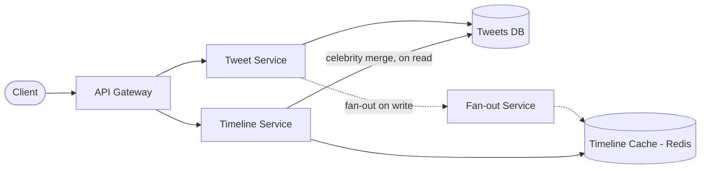
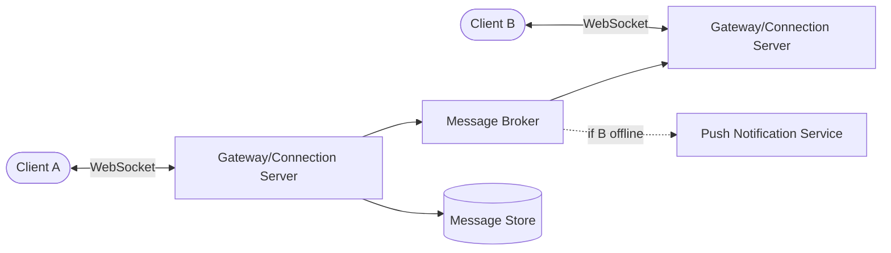
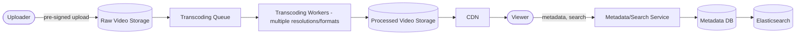
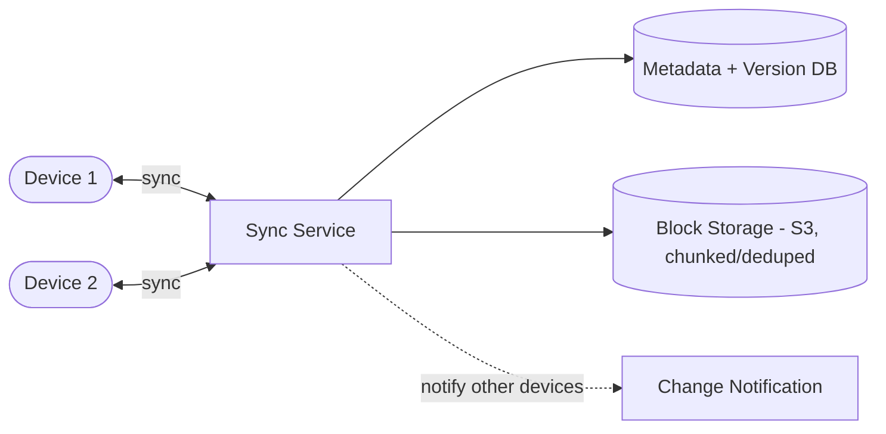
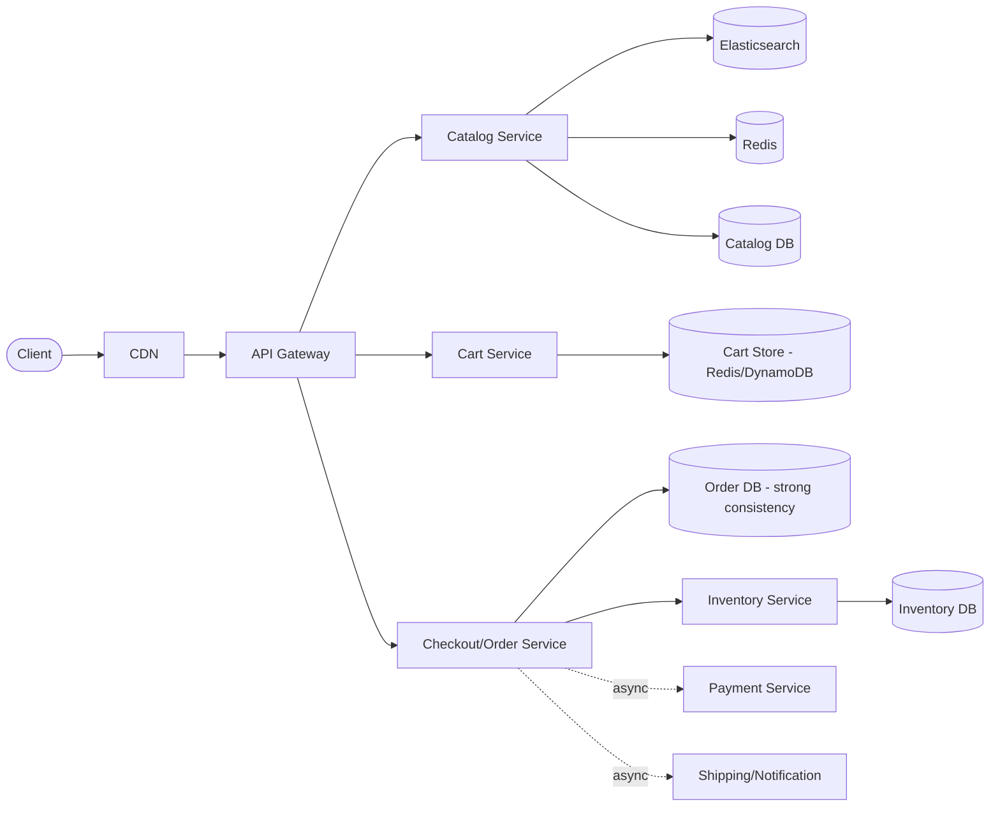
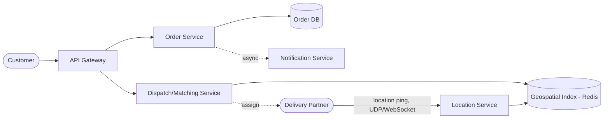

# Chapter 17: System Design Problems — Intermediate Tier

*← [Chapter 16: Beginner Problems](16-Problems-Beginner.md) · [Index](00-Index-and-Assessment.md) · Next → [Chapter 18: Advanced Problems](18-Problems-Advanced.md)*

*These problems have real scale and multiple interacting sub-systems. Where a problem shares structure with an earlier one, this chapter says so explicitly and focuses depth on what's genuinely new — exactly what you should do out loud in a real interview.*

---

## Problem 7: Twitter / X

**1. Requirements** — FR: post a tweet (280 chars + media), follow users, see a home timeline of tweets from people you follow, like/retweet. NFR: read-heavy (Chapter 3.3-style ratio, ~50:1+), timeline latency under ~200ms, celebrities can have 100M+ followers (the defining constraint of this problem).

**2. Capacity estimation** — 200M DAU, 5 tweets/user/day → 1B tweets/day (~11,600/sec avg, ~35,000/sec peak). Timeline reads: 200M × 10 checks/day = 2B/day (~23,000/sec avg, ~70,000/sec peak). Read:write ≈ 60:1.

**3. APIs**
```
POST /tweets           { content, media? }
GET  /timeline?cursor=...
POST /follow/{user_id}
GET  /tweets/{id}
```

**4. Data model** — `tweets` (tweet_id, user_id, content, media_url, created_at), `follows` (follower_id, followee_id), `timeline_cache` (per-user, precomputed — see below).

**5. Architecture**


**6. Request flow (the core design problem)** — This is the canonical **fan-out** problem from Chapter 13.3. On tweet creation, a fan-out service pushes the new tweet into the precomputed timeline cache of every follower ("fan-out on write") — cheap reads later, since a user's timeline is just a cache read. **Exception: celebrity accounts.** Fanning out a single tweet to 100M followers synchronously (or even asynchronously, at real cost) is prohibitively expensive. Instead, celebrity tweets are *not* pushed to every follower's cache; when a user's timeline is read, the service merges their precomputed cache with a live, on-the-fly fetch of recent tweets from any celebrities they follow (fan-out on read, just for that slice) — this hybrid is exactly what Twitter has publicly described.

**7. Database choice** — A wide-column/key-value store (Cassandra-style, or DynamoDB) for tweets themselves — extremely high write volume, simple access pattern (fetch by tweet_id or by user_id + time range), which plays directly to wide-column strengths (Chapter 4.6). The social graph (`follows`) is also commonly a graph-oriented or wide-column store optimized for "get all followers of X" and "get all followees of X" lookups.

**8. Cache strategy** — The precomputed timeline itself, per user, in Redis — this *is* the read path for the common case, not just an optimization on top of a DB query.

**9. Queue strategy** — The fan-out step is inherently async (Kafka/queue-driven) — tweet creation returns immediately to the author; fan-out to followers' caches happens in the background, decoupled from the write path's latency.

**10. Scaling strategy** — Tweet storage shards by tweet_id (or user_id) using consistent hashing (Chapter 5.4); the timeline cache shards by user_id similarly. The fan-out worker pool scales horizontally based on queue depth, same pattern as the notification system in Chapter 16.

**11. Failure handling** — If fan-out lags behind (queue backlog during a viral moment), timelines are briefly stale rather than broken — an acceptable degradation given the eventual-consistency framing below.

**12. Consistency** — Deliberately eventual for the timeline (Chapter 2.5's CAP/PACELC trade-off, chosen explicitly for availability and latency over strict freshness) — a few seconds' delay before your tweet appears in a follower's timeline is an acceptable, well-known trade-off across every major platform with this shape.

**13. Security** — Rate-limit tweet creation and follow actions to control spam/bot behavior; content moderation pipeline (often async, post-publish) for abuse/policy violations.

**14. Observability** — Fan-out queue lag (a direct proxy for "how stale are timelines right now"), timeline read latency, celebrity-merge-path latency specifically (it's a different, more expensive code path worth watching separately).

**15. Bottlenecks** — Celebrity fan-out, solved by the hybrid read/write split above. A secondary bottleneck: extremely active followers of many celebrities have an expensive read-time merge — mitigated with a short-TTL cache of the merged result itself.

**16. Trade-offs** — Precomputed-cache freshness vs. fan-out cost — the entire problem is this one trade-off, resolved differently for normal vs. celebrity accounts.

**17–19. Follow-ups**

| Challenge | Ideal answer |
|---|---|
| "What's your threshold for 'celebrity' — how do you decide who gets fan-out-on-read treatment?" | "A follower-count threshold, e.g., anyone above ~1M followers, computed periodically and cached — not evaluated on every single tweet, since that's itself extra work. I'd also want this to be a smooth, monitored threshold rather than a hard cliff, since an account crossing it needs a graceful transition, not a sudden behavior change." |

**20. 45-minute version** — Requirements/capacity (5 min) → establish fan-out-on-write as the default (5 min) → spend the bulk of remaining time (15+ min) on the celebrity problem and the hybrid resolution, since that's the single question this problem exists to test.

---

## Problem 8: Instagram

Shares the fan-out/feed problem with Twitter almost entirely (Chapter 3.3's worked example already covered this) — in an interview, say so explicitly and spend your differentiated time on what's actually different: **media-heavy content and the upload/processing pipeline**, borrowing directly from the File Upload System (Chapter 16, Problem 4) and Video Streaming (Problem 30) patterns.

**Key differences worth naming:**
- **Upload path:** direct-to-object-storage via pre-signed URLs (Chapter 16, Problem 4), followed by async image/video processing (resizing to multiple resolutions, thumbnail generation) via a queue-triggered worker pool — the same shape as the File Upload problem, applied specifically to media.
- **Serving path:** processed media served via CDN, not the app servers — the feed API returns metadata + CDN URLs, and the client fetches media bytes directly from the CDN edge, keeping heavy bandwidth off your own infrastructure entirely.
- **Data model addition:** `posts` needs `media_urls` (an array/list of CDN-served asset URLs per resolution) rather than a single `content` field.
- **A follow-up worth anticipating:** "How would you build the Explore/recommendation feed, as opposed to the following-based feed?" — this is a pointer forward to Chapter 26 (Recommendation Systems), and the honest answer is that it's a fundamentally different problem (ranking/ML-driven, not simple reverse-chronological fan-out) worth explicitly distinguishing rather than conflating with the home feed.

---

## Problem 9: WhatsApp

**1. Requirements** — FR: 1:1 and group messaging, delivery/read receipts, online presence, message persistence across devices. NFR: extremely high durability (a lost message is a serious product failure), low latency for real-time feel, must support offline delivery (message waits until the recipient reconnects).

**2. Capacity estimation** — From Chapter 3.3, Example 2: ~230,000 msgs/sec avg, ~700,000/sec peak, multi-TB/day raw before replication.

**3. APIs** — Primarily **WebSocket-based**, not REST, given the real-time bidirectional nature (Chapter 1.3): `connect (auth)`, `send_message {to, content}`, `ack_delivered {message_id}`, `ack_read {message_id}`, plus a REST-ish `GET /messages?conversation_id=&before=` for history/pagination on reconnect.

**5. Architecture**


**6. Request flow (the core design problem)** — Each client holds a persistent WebSocket connection to a **connection/gateway server**. Because a system at this scale has *many* connection servers, and sender/recipient can be connected to *different* ones, message delivery requires a **routing layer**: the sending gateway looks up which gateway the recipient is currently connected to (a presence/routing service, commonly backed by Redis mapping `user_id → gateway_instance_id`) and forwards the message there for delivery, while durably persisting the message regardless of whether the recipient is online right now. If the recipient is offline, the message is queued and a push notification (via APNs/FCM, echoing Chapter 16's Notification Service) alerts them; on reconnect, the client fetches undelivered messages via the history API.

**7. Database choice** — A wide-column/key-value store partitioned by conversation_id, optimized for the access pattern "fetch recent messages for this conversation, in order" — Cassandra-style stores are a strong fit given the write volume and simple, known query shape (echoing Chapter 4.6's decision framework).

**8. Cache strategy** — The presence/routing table (`user_id → connection server`) lives in Redis for fast lookups on every message send; recent messages per conversation can be cached for fast history loads on reconnect.

**9. Queue strategy** — A message broker (Kafka or a purpose-built pub/sub layer) decouples the sending gateway from the receiving gateway, so gateways don't need direct server-to-server connections to every other gateway — they all publish to and consume from the broker, keyed by routing information.

**10. Scaling strategy** — Connection servers scale horizontally (each holds a bounded number of concurrent WebSocket connections — a real, known ceiling per instance worth mentioning); message storage shards by conversation_id.

**11. Failure handling** — If a connection server crashes, all clients connected to it are disconnected and must reconnect (routed to a different, healthy server via the LB) — messages already durably persisted are not lost, only the live connection is; presence/routing table is updated on reconnect.

**12. Consistency** — Message *ordering within a conversation* must be preserved (partition by conversation_id in the broker, echoing Chapter 7.2's Kafka ordering guarantee) — this is a hard requirement, unlike the eventual-consistency feed problems above. Delivery/read receipts can be eventually consistent (a receipt arriving a second late is a non-issue).

**13. Security** — End-to-end encryption is WhatsApp's actual, real-world defining security property — worth mentioning explicitly even at a high level: message content is encrypted client-side such that even the server cannot read it, which has real architectural implications (the server can route and store ciphertext, but can't do server-side content processing/search on message content).

**14. Observability** — Message delivery latency (send-to-deliver), connection server health and connection counts, undelivered-message queue depth per user.

**15. Bottlenecks** — A very active group chat (thousands of members) turns one message send into a fan-out problem again (Chapter 13.3) — mitigated similarly, by treating very large groups as a distinct scaling path from 1:1/small-group messaging.

**16. Trade-offs** — Strict per-conversation ordering (a hard requirement) vs. the flexibility eventual consistency would otherwise buy you — this domain simply doesn't get to trade away ordering the way a social feed can.

**17–19. Follow-ups**

| Challenge | Ideal answer |
|---|---|
| "How do you handle a user with 5 active devices all needing the same messages?" | "Multi-device delivery means routing/fan-out targets every registered device's active connection (or queues per-device for offline ones), and read receipts need to reconcile across devices — WhatsApp's real solution involves each device maintaining its own encrypted session, which is a meaningfully harder version of this problem worth flagging as out of scope for a 45-minute version unless the interviewer wants to go there." |

**20. 45-minute version** — The connection-server-plus-routing-layer design (Step 6 above) is the entire point of this problem — get there within the first 15–20 minutes and spend remaining time on ordering guarantees and the offline/push-notification handoff.

---

## Problem 10: YouTube

**1. Requirements** — FR: upload video, transcode to multiple resolutions, stream/watch, search, comments, view counts. NFR: massive bandwidth for playback (Chapter 3.3, Example 8's video streaming numbers apply directly), upload can be large and slow, view counts need to be fast to read but don't need to be exact in real time.

**2. Capacity estimation** — Reuse Chapter 3.3, Example 8: bandwidth, not RPS, is the binding constraint (tens of terabits/sec at real scale) — this reframes the entire architecture toward CDN-first design.

**5. Architecture**


**6. Request flow** — Upload follows the same pre-signed-URL, direct-to-storage pattern as Chapter 16's File Upload problem. Once uploaded, a queue-triggered transcoding pipeline generates multiple resolution/bitrate variants (enabling **adaptive bitrate streaming** — the client's player picks the best variant for current network conditions, switching dynamically). Playback requests are served entirely from the CDN edge, never from origin for popular content; metadata (title, description, view count) and search live in a separate metadata service backed by Elasticsearch (Chapter 22) for search specifically.

**7. Database choice** — Metadata: relational or document DB. Search: Elasticsearch, populated via CDC/an indexing pipeline from the metadata DB (Chapter 6.8's CDC pattern applies directly). View counts: an eventually-consistent counter (Redis `INCR`, periodically flushed to durable storage) — exact real-time view counts are not a real product requirement, so don't over-engineer this into a strongly consistent hot path.

**8–9. Cache/queue** — CDN *is* the cache for this problem, dominant over any application-level cache. The transcoding queue is the core async pipeline — this is directly analogous to Chapter 16's Logging System and Notification System in shape (event triggers async fan-out of work), just applied to video processing.

**10. Scaling strategy** — Transcoding workers scale horizontally based on queue depth; storage and CDN scale essentially without your direct involvement (managed services); metadata DB scales via the standard ladder (Chapter 5.5) — at YouTube's real scale, this is sharded, but for an interview-scoped version, say explicitly at what point you'd cross that threshold.

**11. Failure handling** — A failed transcoding job retries (Chapter 6.2's backoff pattern) and, after repeated failure, lands in a DLQ (Chapter 7.2) for manual/automated inspection rather than silently leaving a video stuck "processing" forever.

**15. Bottlenecks** — Transcoding is CPU/GPU-intensive and can become a real cost and throughput bottleneck during upload spikes — worth mentioning a priority queue (paid/verified creators processed faster) as a realistic mitigation.

**16. Trade-offs** — Transcoding all resolutions upfront (higher upfront cost, instant availability of any quality) vs. transcoding on-demand/lazily for less-popular resolutions (lower cost, added latency on first request for a rarely-used quality) — a genuine, discussable trade-off.

**17–19. Follow-ups**

| Challenge | Ideal answer |
|---|---|
| "How would you implement view count without hammering the database on every single view?" | "Increment a per-video counter in Redis on each view (cheap, fast), and periodically (e.g., every few seconds, batched) flush aggregated deltas to the durable metadata store — the displayed count can lag reality by seconds, which is entirely acceptable for this metric, and this avoids a database write on every single video view, which at this volume would be a serious bottleneck if done synchronously and individually." |

**20. 45-minute version** — Establish the CDN-first framing and the pre-signed-upload + async-transcoding pipeline early (this is 90% of the interesting design) — search and view-count details are natural, quick follow-up depth.

---

## Problem 11 & 12: Dropbox and Google Drive (covered together — same core, different emphasis)

Both are **file storage + sync** systems; the shared core is covered once, then each system's distinguishing emphasis is called out separately — exactly how you should verbally handle two similar questions if asked both across different interview rounds.

**1. Requirements (shared)** — FR: upload/store files, organize into folders, sync across multiple devices, share with other users. NFR: strong durability (data loss is unacceptable), reasonable sync latency, must handle large files and large personal libraries efficiently.

**2. Capacity estimation** — Chapter 3.3, Example 10 applies directly: 250PB total storage at reasonable scale, ~115MB/sec sustained ingress.

**5. Architecture (shared core)**


**6. Request flow — the genuinely hard part of this problem: chunking, deduplication, and sync.** Rather than treating a file as one atomic blob, files are split into fixed-size **chunks/blocks** (this is the real technique Dropbox has published about). Benefits: only *changed* chunks need to be re-uploaded when a file is edited (not the whole file again — critical for large files edited slightly), and identical chunks across different files/users can be **deduplicated** (stored once, referenced many times) via content-hashing each chunk. On any change, the sync service computes which chunks changed, uploads only those, updates the file's chunk-manifest + a new version record, and notifies other connected devices to pull the delta.

**7. Database choice** — Metadata (file tree, permissions, version history) in a relational or document DB — this data is genuinely relational (folder hierarchies, sharing permissions) and benefits from real query flexibility; block storage in S3-class object storage, addressed by content hash.

**8–9. Cache/queue** — Change notifications to other devices are pushed asynchronously (via a queue or a WebSocket/push-based notification channel, echoing the real-time patterns from the WhatsApp problem) rather than devices polling constantly.

**11. Failure handling / conflict resolution** — The genuinely hard follow-up: what happens when the *same file* is edited on two devices while offline, and both come back online? Standard resolution: versioning + either last-write-wins with a "conflicted copy" fallback (Dropbox's actual real-world approach — when it truly can't auto-merge, it creates a second file named "conflicted copy") or, for structured/collaborative documents (see Google Drive's emphasis below), operational transformation / CRDTs for real-time merge.

**12. Consistency** — Read-your-own-writes matters a lot here (a user editing on device A expects to see it reflected everywhere they check) — but full real-time consistency across all devices simultaneously isn't required, just eventual convergence, which is why the conflict-resolution strategy above matters as much as it does.

**Dropbox-specific emphasis:** sync efficiency and offline-first behavior — a user's local client should work fully offline and reconcile on reconnect; the chunking/dedup story above is the headline Dropbox-specific technical depth to bring.

**Google Drive-specific emphasis:** **sharing, permissions, and real-time collaborative editing.** Permissions need a real access-control model (owner, editor, viewer, and inherited folder-level permissions) — worth sketching as its own sub-design (a permissions table keyed by resource + user/group, checked on every access, cached aggressively since permission checks are on the hot path of nearly every request). Real-time co-editing (multiple users typing in the same doc simultaneously) is a genuinely different, harder problem than file sync — it requires either **Operational Transformation (OT)** or **CRDTs (Conflict-free Replicated Data Types)** to merge concurrent character-level edits without conflicts or lost keystrokes, backed by a real-time transport (WebSockets). It's fair and expected to say explicitly: "full collaborative editing is its own deep sub-system — I can go deeper into OT/CRDTs if you want, but at a high level the key insight is that concurrent edits need to be merged at the operation level, not the file level."

**17–19. Follow-ups**

| Challenge | Ideal answer |
|---|---|
| "Two devices edit the same file offline, then reconnect. Walk me through what happens." | "Both devices eventually sync their chunk changes. If the changes touch non-overlapping parts of the file and the format supports it, an automatic merge is possible; otherwise, the system falls back to versioning — keeping both versions and either prompting the user or creating a 'conflicted copy,' rather than silently discarding one user's changes, which would be a much worse failure mode than asking the user to resolve it." |

**20. 45-minute version** — For either variant, establish the metadata/block-storage split and chunking/dedup early — that's shared, foundational depth. Then pick *one* differentiator (sync conflict resolution for Dropbox-flavored questions, or permissions + a brief OT/CRDT mention for Google-Drive-flavored questions) based on how the interviewer frames the question, rather than trying to cover both deeply in one session.

---

## Problem 13: E-commerce System (Flipkart/Amazon-style)

**1. Requirements** — FR: browse/search catalog, product detail pages, cart, checkout, order tracking, reviews. NFR: read-heavy browsing at large scale, checkout/payment needs strong consistency and correctness (Chapter 3.3, Example 5's numbers apply), flash-sale traffic spikes are a defining, explicit scenario to design for.

**5. Architecture**


**6. Request flow — two genuinely different sub-systems under one product.** Browsing/search is read-heavy, cache- and CDN-friendly, and can tolerate slightly stale data (a product's exact stock count doesn't need to be perfectly live on the listing page). Checkout is the opposite: low volume in RPS terms, but must be correct — this is where the **inventory race condition** (two customers buying the last unit simultaneously) is the single most interesting design problem, resolved with either a database-level atomic decrement (`UPDATE inventory SET stock = stock - 1 WHERE product_id = ? AND stock > 0`, checking the affected-rows count) or a distributed lock (Chapter 6.5) for more complex multi-step reservation flows, combined with a Saga (Chapter 6.8) across inventory-reservation, payment, and order-creation as independently owned services.

**7. Database choice** — Catalog: a document DB (MongoDB) fits well given wildly varying attributes per product category (Chapter 4.6's exact reasoning); or a relational DB with a flexible attributes table/JSON column, which is also common in practice. Cart: a fast key-value store (Redis or DynamoDB) — carts are ephemeral, high read/write, and don't need relational integrity. Orders/inventory: relational (PostgreSQL/MySQL) — this is exactly the ACID-transaction-critical data Chapter 4.6 flags.

**8. Cache strategy** — Aggressive caching + CDN for catalog/product pages (the read-heavy majority of traffic); cart data itself often lives directly in a fast store rather than being "cached" per se, since it's the source of truth for an ephemeral entity.

**9. Queue strategy** — Post-checkout side effects (shipping label generation, confirmation email/notification, analytics) are async, following the same pattern as the checkout example in Chapter 8.2.

**10. Scaling strategy** — Catalog/search scales horizontally trivially (stateless, cache-backed); the interesting scaling conversation is **flash-sale readiness** — pre-warming caches, over-provisioning ahead of a known sale event (unlike organic traffic growth, flash sales are usually scheduled and predictable), and a **queue-based checkout throttle** (a virtual waiting room pattern) if instantaneous demand would exceed even a well-scaled checkout path's safe throughput.

**11. Failure handling** — Payment failure mid-checkout triggers the Saga's compensating actions (release inventory reservation); inventory service failure should fail checkout safely closed (never oversell) rather than open.

**12. Consistency** — Explicitly split by sub-system: eventual consistency for catalog/search (fine — see stale stock count above), strong consistency for the inventory-decrement-and-order-creation path (correctness-critical, Chapter 2.5's CP choice made deliberately here even though the rest of the system leans AP).

**13. Security** — PCI-DSS-relevant scope minimization (Chapter 10.6) around anything touching raw payment data — commonly solved by never storing card data directly at all, delegating to a PCI-compliant payment processor and only storing a tokenized reference.

**16. Trade-offs** — The single trade-off worth naming with real conviction: **why the catalog and checkout paths deliberately use different databases and different consistency models**, even within one product — this is the strongest, most senior-sounding insight in this whole problem.

**17–19. Follow-ups**

| Challenge | Ideal answer |
|---|---|
| "How do you prevent overselling the last unit of a flash-sale item during a traffic spike?" | "An atomic conditional decrement at the database level (`WHERE stock > 0`) is the actual source of truth and correctness guarantee — application-level 'check then decrement' logic is a race condition under concurrency, no matter how well-intentioned. For very high-contention single items, I'd also consider a short-lived reservation with a lease/expiry (hold the item for this user for 5 minutes to complete checkout) rather than either a hard lock (kills throughput) or no coordination (oversells)." |

**20. 45-minute version** — Spend real time establishing the catalog-vs-checkout split and consistency reasoning (10 min), then go deep on the inventory race condition specifically (10–15 min) — that's almost always where this interview goes, given how naturally it invites a challenge question.

---

## Problem 14: Food Delivery System (Swiggy/Zomato/Talabat-style)

**1. Requirements** — FR: browse restaurants, place an order, track delivery in real time, restaurant accepts/rejects orders, delivery partner assignment. NFR: real-time location tracking at scale (Chapter 3.3, Example 4), order/payment correctness, three-sided marketplace coordination (customer, restaurant, delivery partner) under real-time constraints.

**5. Architecture**


**6. Request flow — two coupled real-time problems.** (1) **Order flow:** customer places order → restaurant notified, accepts/rejects (often with a timeout and reassignment/refund logic if unanswered) → order enters the dispatch pool. (2) **Matching/dispatch:** the dispatch service needs the nearest available delivery partner, which requires a **geospatial index** (partners' live locations, indexed via geohash or Google S2 cells, held largely in memory/Redis for sub-second nearest-neighbor queries — this is the same core technique Uber uses for driver matching, and worth naming explicitly). Once matched, the delivery partner's live location is streamed to the customer's app via WebSocket/push for real-time tracking.

**7. Database choice** — Orders (relational, correctness-critical, echoing the E-commerce problem's checkout reasoning); live location (Redis, ephemeral, latest-value-matters-most, explicitly *not* the same store as order history — echoing Chapter 3.3, Example 4's point about not conflating these two very different data shapes under one data store).

**8–9. Cache/queue** — The geospatial index in Redis effectively *is* the "cache" for the matching problem. Location pings are ingested via a high-throughput pipeline (Kafka-class, given the sustained ~250,000/sec figure from Chapter 3.3's Uber example applies almost identically here) even though only the *latest* location typically needs to be queried for live matching.

**10. Scaling strategy** — Partition the geospatial index by region/city (a natural, business-aligned sharding key — matching only ever needs to consider partners in the same city/zone anyway, so this isn't just a technical sharding decision, it mirrors the real-world constraint).

**11. Failure handling** — Restaurant non-response within a timeout triggers automatic reassignment or cancellation-with-refund (a Saga-shaped compensating flow, Chapter 6.8); delivery partner app disconnect triggers a grace period before reassignment, avoiding overreacting to a brief network blip.

**12. Consistency** — Order state (accepted/preparing/out-for-delivery/delivered) needs to be a well-defined, strongly consistent **state machine** (Chapter 20 covers this pattern in depth for payments — the same idea applies to order status) — an order should never be observably in two contradictory states. Live location is explicitly eventually consistent and loss-tolerant (Chapter 1.1's UDP reasoning applies directly).

**15. Bottlenecks** — Lunch/dinner rush concentration (the ×5 peak multiplier from Chapter 3.3) stresses both the matching service and restaurant capacity simultaneously — worth mentioning demand-shaping (surge-style dynamic delivery fees, or explicit "restaurant is currently busy, longer wait" messaging) as a real, business-level mitigation alongside the pure infrastructure scaling answer.

**16. Trade-offs** — Matching optimality vs. matching speed — the "perfect" nearest available partner requires more computation/candidates considered than a "good enough, fast" match; real systems bias toward speed with a bounded candidate radius rather than an exhaustive search, since delivery-time SLAs punish slow matching more than slightly-suboptimal matching.

**17–19. Follow-ups**

| Challenge | Ideal answer |
|---|---|
| "Two orders get matched to the same delivery partner simultaneously. How do you prevent that?" | "The assignment itself needs to be atomic — a conditional update on the partner's status ('available' → 'assigned', succeeding only if it was still 'available') at the data layer, the same atomic-decrement principle as the e-commerce inventory problem, not an application-level check-then-assign that races under concurrency." |

**20. 45-minute version** — Establish the order-flow vs. matching/location split early, then spend the bulk of time on the geospatial matching design (index choice, sharding by region, atomic assignment) — that's the problem's real center of gravity.

---

## Problem 15: Hotel Booking

**1. Requirements** — FR: search available rooms by location/dates, view hotel details, book a room, cancel. NFR: **must never double-book a room** (the defining correctness constraint), search needs to be fast across a large, date-dependent inventory.

**4. Data model** — The subtlety: availability isn't a simple `rooms_available` counter like e-commerce inventory — it's inherently **date-ranged** (`room_type_id`, `date`, `available_count`), since a room booked for March 1–3 doesn't affect availability on March 10.

**6. Request flow — the core design problem: preventing double-booking under concurrency, for a date-range resource.** Two customers searching and booking the same room for overlapping dates simultaneously must not both succeed. The robust pattern: represent inventory as **per-date-per-room-type counters** (or a booked-date-ranges table with a database-level exclusion constraint preventing overlapping ranges for the same physical room, which PostgreSQL supports natively via `EXCLUDE` constraints on range types — a genuinely elegant, worth-naming solution), and perform the booking as an atomic conditional operation, exactly echoing the e-commerce inventory pattern but generalized across a date range instead of a single counter.

**7. Database choice** — Relational, without much debate — this is precisely the kind of correctness-critical, range-constrained data that ACID transactions and real constraint enforcement (foreign keys, exclusion constraints) are built for; a document/NoSQL store would force you to reimplement this integrity logic in application code, worse and more error-prone (echoing Chapter 4.6's "MongoDB for everything" critique).

**9–10. Search & scaling** — Search (by location/dates/price) is a separate, read-heavy, cache- and index-friendly path (Elasticsearch or a denormalized search-optimized read model, echoing CQRS from Chapter 6.8) decoupled entirely from the booking/availability write path — searching for available rooms doesn't need to hit the strongly-consistent booking system directly; a brief staleness in search results (a room shown as available that gets booked a second before you click) is acceptable, *as long as the actual booking attempt is re-validated atomically against the real, current availability at commit time.*

**11. Failure handling** — A held-but-unconfirmed booking (user is mid-checkout, entering payment details) should use a short-lived reservation/lease (echoing the flash-sale mitigation in the E-commerce problem) rather than either an indefinite hard lock (blocks other customers unfairly if the user abandons checkout) or no hold at all (a customer's card gets declined after they thought they'd secured the room).

**16. Trade-offs** — Search-result freshness (deliberately slightly stale, for speed and scale) vs. booking-time correctness (must be exactly current, non-negotiable) — the same "different consistency models for different sub-paths within one product" insight as the E-commerce problem, worth explicitly drawing the parallel to if you've been asked both in the same interview loop.

**17–19. Follow-ups**

| Challenge | Ideal answer |
|---|---|
| "How would you handle a popular hotel with only 2 rooms left, being viewed by 500 people at once during a sale?" | "The search/browse path scales normally under this read load — it's cache/CDN-friendly and doesn't touch the booking system. The actual contention only matters at the moment of booking, and the atomic conditional-decrement-per-date pattern handles that correctly regardless of how many people are merely *looking* — the 500 viewers create a read-scaling problem, not a correctness problem, and I'd keep those two concerns explicitly separate rather than over-engineering the browse path for a correctness issue it doesn't actually have." |

**20. 45-minute version** — The date-ranged inventory model and the atomic double-booking prevention are the entire point — establish the data model early (it's less obvious than a simple counter) and spend the bulk of remaining time on the booking-time atomicity guarantee.

---

## Problem 16: Ticket Booking (Movies/Events — BookMyShow/Ticketmaster-style)

Shares its core correctness challenge with Hotel Booking (never double-sell the same seat/slot) but adds a genuinely new dimension: **extreme, synchronized demand spikes** (a popular concert's tickets going on sale at exactly 10:00 AM to a million simultaneous hopeful buyers) — this is the problem's real center of gravity, more than the double-booking logic itself, which is structurally similar to Hotel Booking's.

**1. Requirements** — FR: browse events/showtimes, view seat map, select and book seats, cancel/refund. NFR: must handle extreme concentrated demand at a known, scheduled instant (unlike organic traffic growth, this is predictable and preparable-for), zero double-booking of the same seat.

**6. Request flow — the seat-locking pattern.** Rather than a simple atomic decrement (seats are individually distinct and selected by the user, unlike a fungible hotel-room-type count), the standard pattern is: when a user selects seats, place a **short-lived lock/hold** on those specific seats (via Redis, with a TTL — e.g., 5–10 minutes to complete payment), marking them unavailable to other users immediately; if payment completes within the window, the hold converts to a confirmed, durably persisted booking; if it expires or the user abandons checkout, the lock releases automatically (via TTL expiry) and the seats become available again — no manual cleanup needed. This is functionally the same idea as the Hotel Booking reservation-lease follow-up, made a first-class part of the core design because seat-level granularity makes it unavoidable rather than optional.

**10. Scaling strategy — the "virtual waiting room" pattern.** For a known, scheduled high-demand sale event, the strongest answer isn't "scale the booking service infinitely" (wasteful and still has a hard ceiling) — it's **admission control**: a queue/waiting-room layer in front of the actual booking flow that admits users at a controlled rate the backend can safely sustain, giving users an honest position-in-queue rather than a failed request storm hitting an overwhelmed backend simultaneously. This is a real, published pattern (Ticketmaster, and Indian platforms handling IPL ticket sales, have discussed exactly this) and is the single most differentiating thing to bring up in this problem.

**11. Failure handling** — The TTL-based seat-lock release above *is* the primary failure-handling mechanism for abandoned checkouts — worth stating explicitly that this doubles as both a UX feature (don't hold seats forever) and a correctness/availability mechanism (don't let a crashed client session permanently lock inventory).

**16. Trade-offs** — Fairness (strict first-come-first-served via the waiting room) vs. raw throughput (letting everyone hit the backend at once, fastest-network-connection-wins) — the waiting room deliberately trades a small amount of latency/complexity for a fairer, more controlled, and ultimately more reliable experience under extreme load.

**17–19. Follow-ups**

| Challenge | Ideal answer |
|---|---|
| "A user's payment takes 8 minutes but your seat hold TTL is 5 minutes. What happens, and is that okay?" | "The hold expires and the seats release — from the system's correctness point of view, that's actually the *right* behavior, not a bug; an indefinite hold on contended inventory is worse for everyone else. The UX mitigation is a client-side countdown timer so the user isn't surprised, and possibly a short grace-period re-check ('are these seats still available, extend hold') rather than silently failing after expiry — but the underlying TTL-based release mechanism itself shouldn't change." |

**20. 45-minute version** — Establish the seat-level lock-with-TTL pattern early (5–10 min), then spend the majority of remaining time on the virtual waiting room / admission control design for the flash-sale scenario — that's what separates a strong answer here from a merely correct one.

---

*Next → [Chapter 18: Advanced System Design Problems](18-Problems-Advanced.md) — Uber, Careem, Amazon, Netflix, Payment Systems, Wallets, Ride Matching, Search, Recommendations, Ad Serving, and more.*
