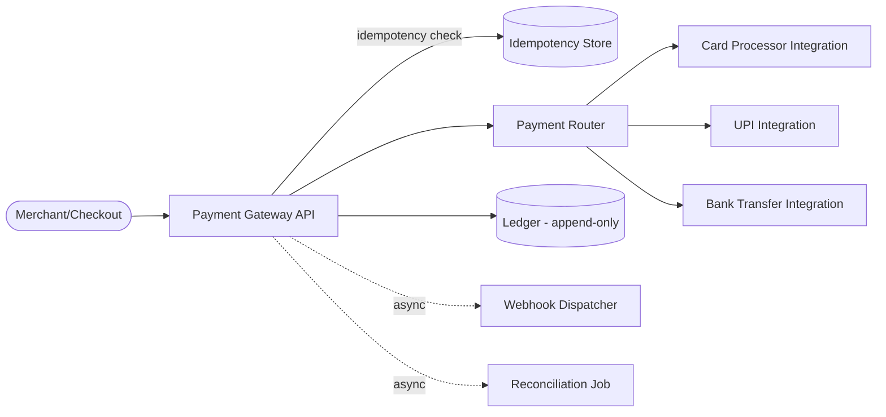
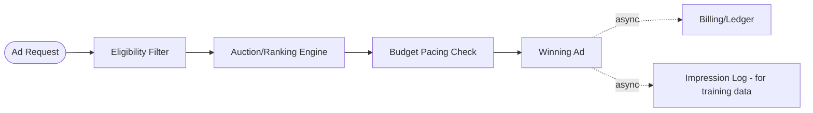

# Chapter 18: System Design Problems — Advanced Tier

*← [Chapter 17: Intermediate Problems](17-Problems-Intermediate.md) · [Index](00-Index-and-Assessment.md) · Next → [Chapter 19: Company-Specific Preparation](19-Company-Specific-Prep.md)*

*Several problems in this tier share real structure with earlier ones (ride-hailing ↔ food delivery matching, chat ↔ WhatsApp, streaming ↔ YouTube). Rather than repeat that shared structure, each problem below explicitly names what it shares and spends its depth on what's genuinely new — do exactly this in a real interview when you recognize a pattern; naming the reuse is itself a strong signal, not a shortcut.*

---

## Problem 17: Uber (Ride-Hailing)

**Shares with Problem 14 (Food Delivery):** the geospatial matching core — geohash/S2-indexed live locations in Redis, sub-second nearest-candidate queries, atomic conditional assignment to prevent double-matching. State that explicitly, then go deep on what's different.

**What's genuinely new here:**

**Trip state machine** — a ride has a stricter, more consequential lifecycle than a food order: `requested → matched → driver_en_route → trip_started → trip_completed → paid`. Each transition needs to be atomic and auditable (Chapter 20's state-machine pattern), because unlike food delivery, disputes over "did the trip actually happen, for how long, what was the fare" have direct financial and even legal weight.

**Surge pricing** — a real-time supply/demand signal: the system continuously computes a **surge multiplier per geographic zone** based on the ratio of open ride requests to available nearby drivers, applied to fare calculation at request time. Architecturally, this means the matching service needs a live, low-latency view of both request volume and driver availability *per zone* — typically maintained as a streaming aggregation (a sliding-window count per geohash cell, recomputed continuously, e.g., via a stream processor over the same location-ping pipeline that feeds matching). The interesting trade-off to name: surge pricing is simultaneously a **supply-demand balancing mechanism** (higher prices pull more drivers into a hot zone and dampen some demand) and a **product/fairness concern** (interviewers may push on this) — a strong answer acknowledges both the systems angle and that the business has real reasons to cap/smooth surge (multiplier caps, gradual increase/decrease rather than step changes) rather than purely optimize a market-clearing price.

**ETA prediction** — a genuinely ML-flavored sub-system (route distance/time isn't just "as the crow flies" — it needs real road-network routing plus live traffic conditions), worth acknowledging as a distinct service (an "ETA service," likely backed by a routing engine and historical + live traffic data) rather than folding into the matching service itself.

> **Interview challenge → answer:** "How would you match a rider to the *best* driver, not just the nearest one?" → "Nearest-by-distance is the fast, simple first filter — but the actual assignment should consider a small candidate set (say, the 5–10 nearest) and rank by a combined score: ETA (which isn't purely distance, given traffic), driver rating, and vehicle type match, computed only across that narrowed candidate set to keep matching latency low. This is a two-stage pattern — cheap broad filtering, then more expensive precise ranking on a small set — that shows up constantly in large-scale systems, including recommendation and search (Chapter 18, Problems 26 and 25)."

---

## Problem 18: Careem (Super-App Architecture)

**Shares with Problem 17 (Uber):** the entire ride-hailing core above — matching, surge, trip state machine.

**What's genuinely new: the "super-app" problem.** Careem (like Grab in Southeast Asia) operates rides, food delivery (Careem Food), and payments/wallet (Careem Pay) under one app and account — this is a real, publicly discussed architectural challenge distinct from a single-vertical product, and worth bringing up specifically for UAE/MENA-region interviews given this roadmap's stated target companies.

**The core design tension:** each vertical (rides, food, payments) has its own bounded context and arguably should be its own set of services with independent scaling and deployment (Chapter 8.1) — but they need to share a **common identity/account, wallet balance, and often a unified trip/order history and support experience**, which pulls toward shared platform services.

**A sensible resolution to describe:**
- **Vertical-specific services** (ride-matching, food-ordering, each with their own data stores) remain independently owned and scaled, following the database-per-service principle.
- **Shared platform services** — identity/auth, the wallet/payments ledger (Problem 22 below), notifications, and a unified "activity feed"/support view — are genuinely shared, cross-vertical services, since duplicating a wallet or identity system per vertical would be both wasteful and a correctness risk (two different balances for the same user is a serious bug class).
- **Cross-vertical consistency** (e.g., "pay for this ride using wallet balance, which needs a real-time debit") uses the same Saga/idempotency patterns (Chapter 6.8, Chapter 20) as any cross-service financial flow — the ride service doesn't directly manipulate wallet balance; it calls the wallet service's API, which owns that data and its own consistency guarantees.

> **Interview challenge → answer:** "Should Careem Food and Careem Rides share the same matching/dispatch infrastructure, since both involve geospatial assignment?" → "There's a real case for a shared, generalized **dispatch/matching platform service** — geospatial indexing, nearest-candidate queries, and atomic assignment are genuinely the same underlying capability whether you're matching a rider to a driver or an order to a delivery partner. I'd lean toward building it as a shared internal platform capability with vertical-specific business rules (surge for rides, batching for food, Chapter 18 Problem 24) layered on top by each vertical's own service, rather than either fully duplicating the matching logic per vertical or forcing both verticals into one tightly coupled service — this is a good example of finding the right bounded-context line at the *capability* level, not the *product* level."

---

## Problem 19: Amazon (Global E-commerce Marketplace)

**Shares with Problem 13 (E-commerce):** catalog/search/cart/checkout core, the inventory race-condition pattern, the catalog-vs-checkout consistency split.

**What's genuinely new at Amazon's actual scale and business model:**

**Multi-tenant marketplace (third-party sellers)** — unlike a single-retailer e-commerce system, most of the catalog is listed and fulfilled by independent third-party sellers, which means the data model needs a `seller_id` on listings, **per-seller inventory** (the same product can be sold by multiple sellers, each with independent stock and pricing — the "Buy Box" problem of deciding which seller's offer to show/default to), and a seller-facing API surface (listing management, order fulfillment) that's an entirely separate product surface from the customer-facing one, with its own scaling and auth concerns.

**Warehouse/fulfillment and logistics** — order fulfillment isn't just "charge the card and ship" — it involves inventory across multiple **fulfillment centers**, choosing which warehouse fulfills a given order (nearest-with-stock, echoing the geospatial matching pattern again, applied to warehouses instead of drivers), and a genuinely complex logistics/routing sub-system that's its own large design problem — appropriate to name as a distinct bounded system ("Fulfillment Service") you'd scope separately rather than conflate into "the order service."

**Scale numbers worth anchoring to:** Amazon's real published scale involves hundreds of millions of products and peak events (Prime Day, Black Friday) with order-of-magnitude traffic multipliers far beyond Chapter 3's default ×2–3 — worth explicitly naming a much higher peak multiplier (×10 or more) and discussing pre-event capacity provisioning as a planned, scheduled activity (echoing the Ticket Booking problem's "known, scheduled spike" framing) rather than pure reactive autoscaling.

> **Interview challenge → answer:** "How do you decide which seller's offer wins the Buy Box when multiple sellers list the same product?" → "This is fundamentally a ranking problem, not a pure data-lookup — factors typically include price, seller performance/rating, fulfillment speed (Amazon-fulfilled vs. seller-fulfilled), and stock availability, computed and cached per product rather than calculated live on every page view given how expensive a multi-factor ranking would be at that read volume. I'd treat this the same way as the two-stage filter-then-rank pattern from the Uber matching problem — precompute/cache the ranking, invalidate on relevant changes (price update, stock-out), rather than recomputing per request."

---

## Problem 20: Netflix (Subscription Video Streaming)

**Shares with Problem 10 (YouTube):** CDN-first playback, adaptive bitrate streaming, the transcoding pipeline.

**What's genuinely new:**

**Personalized home page / recommendations** — unlike YouTube's search- and subscription-driven discovery, Netflix's defining UX surface is a highly personalized, per-user ranked home page (different rows, different ordering, even different thumbnail art per user) — this is squarely the Recommendation System problem (Problem 26 below) applied as the *primary* product surface rather than a secondary feature, worth explicitly cross-referencing.

**Regional content licensing** — a genuinely unique constraint: which titles a given user can see/stream depends on their region's licensing agreements, meaning **every catalog read is implicitly filtered by the user's location**, and content availability windows change over time (a title can expire from a region on a specific date) — this needs to be modeled explicitly in the catalog data (a `licensing_windows` table keyed by title + region + date range) and enforced at the API layer, not left as a client-side or CDN-level concern, since it's a real legal/contractual requirement, not just a UX preference.

**Netflix's own CDN (Open Connect)** — worth namedropping as a real, publicly documented architecture choice: rather than relying purely on third-party CDNs, Netflix operates its own edge caching appliances placed directly inside ISP networks, specifically because video is such an overwhelming share of their bandwidth that owning the edge delivery economics justified building CDN infrastructure most companies would simply rent — a good example of "at sufficient scale, the build-vs-buy calculus for infrastructure itself can flip," worth mentioning as a scale-dependent trade-off rather than a universal recommendation.

**Offline downloads** — a sync-and-DRM problem (download an encrypted, time-limited copy for offline playback) that echoes both the File Storage/Dropbox sync pattern (Problem 11/12) and adds licensing-expiry enforcement even while offline (a local, time-bounded DRM key) — worth a one-sentence acknowledgment as a distinct sub-problem rather than deep-diving unless asked.

> **Interview challenge → answer:** "How would you personalize the home page for 200M+ users without recomputing rankings on every page load?" → "Precompute personalized rankings offline/asynchronously (batch or near-real-time, per-user or per-user-segment) and serve the precomputed result at read time, refreshing on a schedule or in response to significant new signal (a completed watch, an explicit rating) rather than synchronously ranking on every single page load — this is the same 'precompute the expensive part, serve fast at read time' principle as the Twitter timeline (Problem 7) and the Amazon Buy Box ranking above, just applied to a recommendation model instead of a simple feed or ranking rule."

---

## Problem 21: Payment System (Payment Gateway / PSP — Razorpay/Stripe-style)

*This is the single highest-value problem in the entire roadmap for your stated fintech interest — read alongside [Chapter 20: FinTech System Design](20-Fintech-System-Design.md), which covers the ledger/double-entry/reconciliation depth this problem draws on.*

**1. Requirements** — FR: accept a payment (card/UPI/wallet/bank transfer), route it to the appropriate payment method processor, handle success/failure/pending states, support refunds. NFR: **correctness is the entire point** — no double charges, no lost transactions, full auditability, strict idempotency, and reasonable latency (users are actively waiting during checkout).

**5. Architecture**

**6. Request flow — the core design problem.** A payment request arrives with a client-generated **idempotency key** (Chapter 6.4/9.4 — non-negotiable here); the gateway checks if this key has been processed before and returns the stored result if so. Otherwise, the **payment router** selects the appropriate downstream processor/rail based on payment method and business rules (cost, success-rate history, even A/B routing across multiple processors for the same method — a real technique payment companies use to optimize success rates), and the transaction moves through an explicit **state machine**: `initiated → processing → success | failed | pending`, with every transition written to an **append-only ledger** (never mutate a transaction record in place — this is the audit-trail requirement, and it directly enables reconciliation). Once resolved, the result is communicated back both synchronously (the checkout response) and asynchronously via **webhooks** to the merchant (since some payment methods, like bank transfers, resolve minutes or hours later, not synchronously).

**7. Database choice** — Strictly relational (PostgreSQL/MySQL) for the transaction/ledger core — this is the canonical ACID-transaction-required use case (Chapter 4.6), full stop; a NoSQL store here would force you to rebuild transactional integrity in application code for the one domain where that's least acceptable.

**11. Failure handling — the hardest and most interview-worthy part.** What happens if the gateway calls the card processor, the processor actually charges the card successfully, but the response is lost before the gateway receives it (Chapter 6.1's "you cannot distinguish slow from dead" problem, applied directly)? The gateway must not assume failure and blindly retry the charge (double-charge risk) — instead, it should mark the transaction `pending`/`unknown`, and a **reconciliation job** periodically queries the processor's own record of the transaction (most processors expose a "check status by our reference ID" API precisely for this reason) to resolve the true final state, rather than guessing.

**12. Consistency** — Strong, non-negotiable, throughout the transaction/ledger path — this domain simply doesn't get an eventual-consistency option for the core money-movement logic, unlike almost every other problem in this roadmap; asynchronous elements (webhook delivery, receipt emails) are the only pieces allowed to be eventually consistent.

**16. Trade-offs** — Routing for lowest cost vs. routing for highest success rate — a real, ongoing business trade-off payment companies tune continuously, worth naming to show you understand this isn't a purely technical decision.

**17–19. Follow-ups**

| Challenge | Ideal answer |
|---|---|
| "The processor's webhook telling you a payment succeeded arrives, but your database write to mark it 'success' fails right after. What state is the system in, and how do you recover?" | "This is exactly the Outbox pattern's problem shape (Chapter 6.8) — you can't let 'update the DB' and 'have already told the merchant it succeeded' happen as two independently-failable steps. I'd process the webhook by first durably recording the raw webhook event (append-only, before any business logic runs), then process it — if processing fails partway, a retry/replay of the stored webhook event can safely resume, using the same idempotency-key discipline as the original request, rather than losing the update entirely." |

**20. 45-minute version** — Idempotency (5 min) → state machine + append-only ledger (10 min) → the "processor call outcome unknown" failure scenario and reconciliation (15 min, this is the highest-value depth) → webhook delivery reliability if time allows.

---

## Problem 22: Wallet System (Digital Wallet — PhonePe/Paytm-style)

**Shares with Problem 21:** idempotency, state machines, strong consistency requirements, append-only ledger philosophy.

**What's genuinely new: the ledger is the primary data model, not a side effect.** A wallet's balance should never be a single mutable `balance` column updated in place — the industry-standard, audit-safe pattern is **double-entry ledger accounting**: every transaction creates two balanced entries (a debit and a credit) across accounts, and a user's "balance" is *derived* by summing their account's entries, not stored and mutated directly. This is worth explaining precisely, since it's a specific, checkable piece of domain knowledge interviewers at PhonePe/Razorpay-style companies explicitly probe for (Chapter 20 covers this in full depth — this problem is where you apply it end to end).

**Why derive balance instead of storing it directly:** a stored, directly-mutated balance is one bad concurrent update away from being wrong with no way to know *how* it became wrong — an append-only ledger of individual entries means the current balance is always reconstructable and auditable from first principles, and any discrepancy can be traced to the exact entry that caused it. In practice, systems maintain a cached/materialized current balance for fast reads (recomputing by summing all history on every balance check would be far too slow at scale) but treat the ledger, not the cached balance, as the actual source of truth — the cache is invalidated/recomputed incrementally on each new entry, not trusted blindly forever.

**Core flows:** top-up (external payment → wallet credit entry), P2P transfer (a debit on sender's account + credit on receiver's account, both created atomically in one transaction — this is where a single-database ACID transaction is genuinely sufficient, unlike cross-service Sagas, *if* both accounts live in the same database, which is a strong reason to keep the ledger as one tightly-consistent service rather than splitting it further), and wallet-to-external payout (a debit + an outbound payment via Problem 21's gateway, correctly modeled as its own two-step flow with its own failure/reconciliation handling).

> **Interview challenge → answer:** "Two P2P transfers hit the same sender's wallet simultaneously, together exceeding their balance. How do you prevent an overdraft?" → "The debit needs to be an atomic, conditional operation at the database level — `UPDATE ... SET balance = balance - X WHERE account_id = ? AND balance >= X`, checked via affected-row-count, inside a transaction that also writes the paired ledger entries — the same atomic-conditional-update principle as the e-commerce inventory and hotel-booking problems, just applied to money instead of stock. This is also exactly why keeping both entries of a single logical transaction within one ACID-transactional database matters — trying to coordinate this correctly across two separately-owned services would need a full Saga with much harder overdraft-prevention semantics, for no real benefit here since there's no product reason the ledger needs to be split across services."

---

## Problem 23: Ride Matching Engine (Algorithmic Deep-Dive)

Where Problem 17 (Uber) covers the *product*, this problem is what to reach for if an interviewer specifically wants to go deep on **the matching algorithm itself**, treating it as a standalone systems + light-algorithms problem.

**The core techniques worth being able to describe precisely:**

- **Geospatial indexing:** dividing the map into cells (via **geohashing** — encoding lat/long into a string where shared prefixes mean geographic proximity — or **Google's S2 library**, which uses a different, more uniform cell-based sphere decomposition with fewer distortion issues near poles/boundaries than geohash) so "find nearby drivers" becomes "look up drivers in this cell and its neighbors" instead of a full scan.
- **Two-stage filter-then-rank:** (as introduced in Problem 17) cheaply narrow to a small candidate set via the geospatial index, then apply a more expensive, higher-quality ranking (ETA, rating, vehicle type) only to that narrowed set — this pattern is worth being able to justify precisely: ranking every driver in a city on every request is wasteful; filtering first bounds the expensive work to a small, relevant set.
- **Bipartite matching framing:** at a city-wide level, "which riders should be matched to which drivers" is a classic **bipartite matching** problem (from graph theory) — real systems don't run an expensive optimal-matching algorithm (like the Hungarian algorithm) per individual request in real time, since that's too slow for the sub-second latency needed; instead, most production systems use a **greedy, per-request nearest-good-match** approach (as in Problem 17) for latency, sometimes supplemented by a periodic **batched, windowed optimization** (collect requests/drivers over a short window, e.g., a few seconds, and solve a more optimal matching across that batch) in zones/times where a few seconds of added latency is an acceptable trade for meaningfully better overall matching efficiency — worth naming as the real trade-off (latency vs. matching optimality) rather than presenting either approach as strictly superior.

> **Interview challenge → answer:** "Why not always use the theoretically optimal matching algorithm?" → "Optimal bipartite matching algorithms don't run in the sub-second, per-request latency budget this problem needs at real scale, and by the time you'd finish computing a 'globally optimal' match, the underlying driver positions have already changed. A fast, good-enough greedy match per request, refreshed continuously, tends to outperform a slower globally-optimal one in practice for a real-time system — this is a recurring theme in large-scale systems: a fast approximate answer computed continuously often beats a slow exact answer computed occasionally."

---

## Problem 24: Food Delivery at Scale — Batching and Fleet Optimization

Builds directly on Problem 14. At true city-wide scale, the single biggest efficiency lever beyond basic matching is **order batching**: assigning one delivery partner multiple orders along a sensible route (e.g., two nearby restaurants both fulfilling orders that end up going to nearby drop-off points) instead of one delivery partner per order — this materially improves delivery-partner utilization and, done well, delivery times too.

**What batching adds architecturally:** the dispatch service now needs to reason about small combinatorial route options (which 2–3 pending orders, if any, are worth combining for a given available partner, given pickup/drop-off proximity and time constraints) rather than a single nearest-match decision — still bounded/greedy for latency reasons (echoing Problem 23's trade-off), typically implemented as a scoring function over a small candidate set of "could this new order reasonably be added to this partner's current route" rather than a full route-optimization solver run live.

**Demand-supply balancing at the city level:** beyond individual matching, a food-delivery platform at scale needs city/zone-level visibility into imbalance (too many restaurants with ready orders, too few available partners in a zone) to trigger business-level responses — dynamic delivery fees, temporarily pausing new orders from oversaturated restaurants, or incentivizing partners toward under-served zones — worth mentioning as the same real-time streaming-aggregation pattern as Uber's surge pricing (Problem 17), applied to a different business lever.

> **Interview challenge → answer:** "How do you decide whether to batch two orders onto one delivery partner?" → "A scoring function evaluating the added detour cost (extra distance/time versus delivering each separately) against a threshold, only considered for orders whose pickup and drop-off are already geographically compatible — I'd bound this to a small candidate window (orders currently pending within a short radius/time of the partner's current route) rather than searching the entire city's pending orders for every assignment decision, keeping it fast enough for real-time dispatch."

---

## Problem 25: Search System (Applied — E-commerce Search)

A full search-systems deep dive (inverted index, tokenization, ranking, autocomplete) lives in **[Chapter 22](22-Search-Systems.md)** — this entry is the applied, product-scoped version: designing search specifically for a large e-commerce catalog.

**Key applied decisions, pointing to Chapter 22 for mechanics:** an Elasticsearch cluster indexed from the catalog DB via CDC (Chapter 6.8's pattern, keeping search eventually consistent with the source of truth, which is an acceptable trade-off — a newly listed product appearing in search a few seconds late is a non-issue); ranking that combines text relevance with **business signals** (in-stock status, popularity/sales velocity, seller quality, sponsored placement) rather than pure text-match score alone, since a purely relevance-ranked e-commerce search would surface out-of-stock or low-quality results ahead of what actually converts; and **faceted filtering** (category, price range, brand, rating) computed efficiently via Elasticsearch's aggregation features rather than naively filtering after the fact.

> **Interview challenge → answer:** "How would you rank sponsored (ad) listings alongside organic search results?" → "Treat it as a blended ranking problem, not a separate concern bolted on — sponsored listings get a bid/relevance-adjusted score injected into the same ranking pass as organic results, typically with a cap on how many sponsored slots appear and clear labeling, rather than either a fully separate sponsored section (which advertisers find less valuable, since it's more easily ignored) or letting bid amount alone override relevance entirely (which degrades user trust in search over time and is a real, discussed tension at real ad-supported marketplaces)."

---

## Problem 26: Recommendation System

**1. Requirements** — FR: given a user (and context — what they're currently viewing, their history), return a ranked list of relevant items (products, videos, posts). NFR: must be fast at serving time (users won't wait seconds for a homepage to load), and needs to incorporate fresh signal (a user's very recent activity) without requiring a full model retrain per request.

**The standard two-stage architecture (the core answer to this problem):**

1. **Candidate generation:** from potentially millions/billions of items, cheaply narrow down to a few hundred plausibly relevant candidates — common techniques include **collaborative filtering** ("users similar to you liked these"), **content-based filtering** (items similar in attributes/embedding-space to what you've engaged with), and simple heuristics (trending, popular-in-your-region). This stage prioritizes recall and speed over precision.
2. **Ranking:** apply a more expensive, higher-quality model to just those few hundred candidates to produce the final ordered list — this is the same two-stage filter-then-rank pattern from Problem 23 (ride matching) and Problem 19 (Amazon's Buy Box), a genuinely recurring shape across large-scale systems, worth explicitly naming the parallel if you've covered any of those problems in the same interview loop.

**Architecture note — the feature store:** both stages need consistent, fast access to features (user history, item attributes, recent engagement signals) — production recommendation systems typically maintain a **feature store**, a specialized system providing low-latency feature lookups at serving time that stay consistent with what was used during model training (a real, known failure mode called "training-serving skew" — the model behaves differently in production than in training because the features were computed differently in each environment — worth naming as a symptom of *not* having a proper feature store).

**Freshness vs. cost:** candidate generation and even ranking models are typically retrained/refreshed on a schedule (hourly/daily), not per-request — but a real system layers in a fast, lightweight "recent activity" signal (e.g., re-rank slightly based on the last few minutes of clicks) on top of the base model's output, giving a feel of freshness without needing real-time model retraining, which isn't practical at serving latency.

> **Interview challenge → answer:** "A user just viewed a product 30 seconds ago — why doesn't your recommendation homepage reflect that instantly?" → "The base ranking model is intentionally not recomputed per request — it's too expensive and there's no need to, since most signal that matters for ranking quality doesn't change minute to minute. What *should* update near-instantly is a lightweight overlay: a 'recently viewed' or 'because you looked at X' row driven directly by a fast read of recent activity, separate from the heavier model-driven rows — mixing 'cheap and fresh' with 'expensive and precomputed' in the same page is the standard resolution, not trying to make the expensive part real-time."

---

## Problem 27: Ad Serving System

**1. Requirements** — FR: given a page/app impression opportunity, select and return an ad within an extremely tight latency budget (real-time bidding auctions typically must resolve in well under 100ms end-to-end, including any external bidder round trips). NFR: extremely high request volume (every page view/app screen is a potential ad opportunity), strict advertiser **budget pacing** (don't overspend a campaign's daily budget, don't underspend it either), and auction fairness/correctness.

**5. Architecture — the auction pipeline**

**6. Request flow** — An incoming ad opportunity first passes an **eligibility filter** (targeting rules — geography, demographics, campaign active/paused, remaining budget not exhausted) to narrow a potentially huge candidate ad pool down to a relevant subset — the same filter-then-rank shape as Problems 23/26. The **auction engine** then scores/ranks the eligible candidates (a function of bid amount and predicted relevance/click-through-rate — a genuinely ML-scored component, echoing Problem 26's ranking stage) and selects the winner, typically via a **second-price auction** mechanism (the winner pays the second-highest bid, not their own — a well-established mechanism-design choice that incentivizes truthful bidding, worth naming if asked why). Billing and detailed logging happen **asynchronously**, after the ad is already served — the serving path cannot afford to wait on a synchronous billing/ledger write given the latency budget.

**10. Budget pacing** — a genuinely interesting distributed-systems problem: a campaign's daily budget is a single logical constraint, but ad-serving is happening from many parallel servers simultaneously across the day — naive per-request budget checks against a central counter would either become a bottleneck (every ad request serializing on one counter) or race (overspending past the budget under concurrency). The standard resolution: pace spend by **allocating budget in small chunks to each serving node/region** (e.g., "you have $50 of this campaign's budget to spend in the next 5 minutes"), replenished periodically from the central budget tracker, trading a small amount of potential over/under-spend precision for the ability to check budget locally, fast, without a synchronous global round trip on every single ad request — a direct, practical application of the quorum/coordination trade-offs from Chapter 6.5, applied to a money-pacing problem instead of a data-consistency one.

> **Interview challenge → answer:** "How do you keep the auction under 100ms including external bidders in a real-time-bidding scenario?" → "A hard timeout on external bidder responses — if a third-party bidder hasn't responded within, say, 50ms, the auction proceeds without their bid rather than waiting, treating a slow external response exactly like a failure (Chapter 6.1's 'can't distinguish slow from dead,' applied directly) — a missed bid opportunity for that one impression is a far smaller cost than blowing the latency budget for every ad request waiting on the slowest possible external partner."

---

## Problem 28: Distributed Notification System (Multi-Region)

Builds directly on Problem 5 (Notification Service) — the per-channel queue and worker-pool design is unchanged. What's new here is explicitly **multi-region** operation: users and their notification preferences/status live in specific regions (for data residency/latency reasons), but a single logical campaign or triggered event might need to reach users across multiple regions simultaneously.

**What multi-region adds:** the notification API/orchestration layer needs to route each notification to the correct **regional** queue/worker pool based on the target user's home region (rather than a single global queue), both for latency (workers closer to the relevant provider endpoints/users) and for data-residency compliance (Chapter 10.6) if regulations require user data to stay within a region. A campaign spanning multiple regions is decomposed at the orchestration layer into per-region sub-jobs, each independently scaled and monitored — worth explicitly contrasting with a naive single-global-queue design, which would create unnecessary cross-region traffic and a single non-resilient chokepoint.

**Delivery guarantee tightening:** "distributed" in this framing often also implies a stricter requirement than Problem 5's default (some notifications — a payment/security alert, an OTP — are genuinely important to guarantee delivery for, not just best-effort) — worth explicitly distinguishing **best-effort notification classes** (marketing) from **guaranteed-delivery classes** (security/transactional), with the latter getting stronger retry/DLQ/alerting treatment and potentially a fallback channel cascade (try push, fall back to SMS if undelivered within N minutes) rather than one uniform policy for every notification type.

> **Interview challenge → answer:** "An OTP notification absolutely must be delivered within 10 seconds, but your queue is currently backed up during a broadcast campaign. What do you do?" → "This is exactly why I'd never run transactional/time-critical notifications (OTPs, security alerts) through the same queue/worker pool as bulk marketing broadcasts — they need separate priority lanes with independent capacity, so a marketing campaign's queue depth can never starve an OTP's delivery. I'd go further and give OTP-class notifications a dedicated, smaller, tightly-latency-monitored pipeline entirely, since the cost of over-provisioning a small, critical pipeline is trivial compared to the cost of a failed login OTP."

---

## Problem 29: Real-Time Chat at Scale (Slack/Discord-style)

Builds on Problem 9 (WhatsApp) — the connection-server-plus-routing-layer core is unchanged. What's genuinely different in a Slack/Discord-shaped problem is the shift from mostly-1:1/small-group messaging toward **large, persistent channels** (a busy Discord server or Slack workspace channel can have thousands of members, all of whom should see every message) and **searchable message history** as a first-class feature, not an afterthought.

**What large channels change:** broadcasting a single channel message to thousands of simultaneously-connected members is a fan-out problem again (Chapter 13.3) — rather than WhatsApp's small-group assumption, this needs the same fan-out-on-write infrastructure as the Twitter timeline problem (Problem 7), just applied to "push this message to every currently-connected member's WebSocket session" instead of "push this post to every follower's cached timeline." For members who are offline/not currently connected, the message simply persists (same durable-storage-first principle as WhatsApp) and is fetched on next connect — no need to "deliver" to an absent connection at all.

**Presence at scale** — showing "who's online" for a workspace/channel of thousands is itself a real design point: rather than pushing presence updates to every member on every state change (a fan-out explosion of its own), most systems present presence **lazily/on-demand** (fetch current presence when a user opens a member list) combined with a lightweight, batched broadcast for the smaller set of users currently actively viewing that specific view — a good example of not applying the same "push everything everywhere" instinct uniformly across every feature just because it worked for messages.

**Searchable history** — this is Chapter 22's search-system machinery (an inverted index, likely Elasticsearch) applied to message content, populated via the same async, eventually-consistent indexing pipeline as the E-commerce and general Search problems — worth noting explicitly that message search does *not* need to be on the synchronous message-send critical path at all.

> **Interview challenge → answer:** "A single Discord server has 500,000 members, but only 5,000 are online at once. How do you avoid wasting resources tracking the other 495,000?" → "Connection state (who's actually connected to a WebSocket right now) is naturally sparse and only needs to be tracked for the currently-connected subset — there's no need to maintain any live state for offline members at all; membership itself (the list of 500,000) is a separate, much cheaper, mostly-static piece of data queried rarely and cached aggressively, while the fan-out/routing layer only ever needs to reason about the currently-connected 5,000 for any given real-time broadcast." 

---

## Problem 30: Live Video Streaming (Twitch-style)

Builds on Problem 10 (YouTube) — the CDN-first, adaptive-bitrate-streaming philosophy carries over directly. What's fundamentally different is that **live** streaming cannot use YouTube's offline batch-transcode-then-serve pipeline at all — there's no complete file to transcode ahead of time; video must be ingested, processed, and distributed continuously, with end-to-end latency (broadcaster to viewer) as a first-class, tightly-budgeted requirement rather than an afterthought.

**Live ingest and segmented delivery:** a broadcaster's stream is ingested continuously (commonly via RTMP) and encoded into short segments (a few seconds each) using a protocol like **HLS** or **DASH**, which viewers' players fetch and play sequentially, staying just behind the live edge — a fundamentally different mechanism than "here is one complete file, stream ranges from it" (YouTube VOD), and worth being able to state precisely: the "file" a live viewer's player is working from is really a constantly-appended, sliding playlist of short segments, not a single static object.

**Latency vs. quality vs. scale — the defining three-way trade-off of this problem:** shorter segments reduce end-to-end latency (a viewer isn't waiting on a big chunk to encode/upload/download) but increase overhead (more segment requests, more encoding overhead per second of content) and can hurt encoding efficiency slightly; this is a genuinely different trade-off shape than VOD, where you can spend more time/CPU per video to get better compression since there's no live-latency pressure at all.

**Live chat alongside the stream** — this is a direct application of Problem 29's fan-out-to-thousands-of-connections chat design, running in parallel with the video pipeline, worth explicitly naming as "the same real-time chat architecture from Problem 29, not a new design" rather than re-deriving it.

> **Interview challenge → answer:** "A stream suddenly goes from 100 viewers to 500,000 viewers in ten minutes because it's going viral. What breaks first, and how do you prevent it?" → "The origin/ingest and first-tier encoding infrastructure is the real risk — CDN edge capacity scales relatively gracefully by design (that's exactly what a CDN is for), but if every edge node has to pull the same segments from a single origin, the origin itself can become the bottleneck under a true viral spike. I'd rely on the CDN's own multi-tier caching (edge nodes pulling from regional mid-tier caches, which pull from origin only once per segment, not once per edge node) to keep origin load roughly constant regardless of total viewer count — the same 'don't let popularity multiply load on your single source of truth' principle as the hot-key caching problem in Chapter 4, just at CDN-tier scale instead of application-cache scale."

---

*Next → [Chapter 19: Company-Specific Preparation](19-Company-Specific-Prep.md) — what to expect at Amazon, Google, Microsoft, Meta, Uber, Atlassian, Airbnb, Flipkart, Walmart, Razorpay, PhonePe, CRED, Meesho, Swiggy, Zomato, Zepto, Careem, Noon, Talabat, Deliveroo, and fintech UAE companies — based on current, researched interview patterns.*
