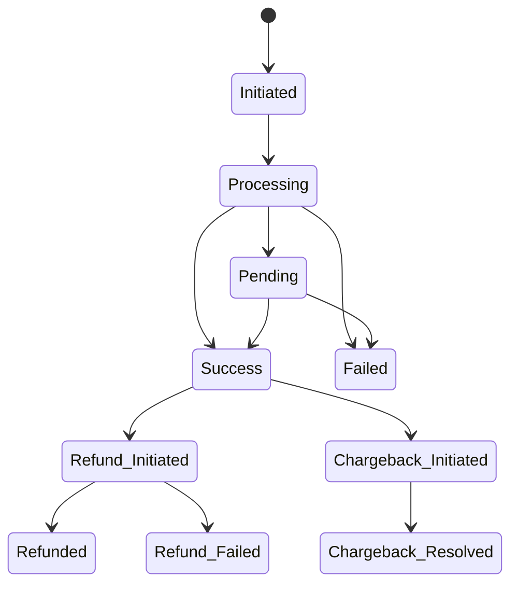
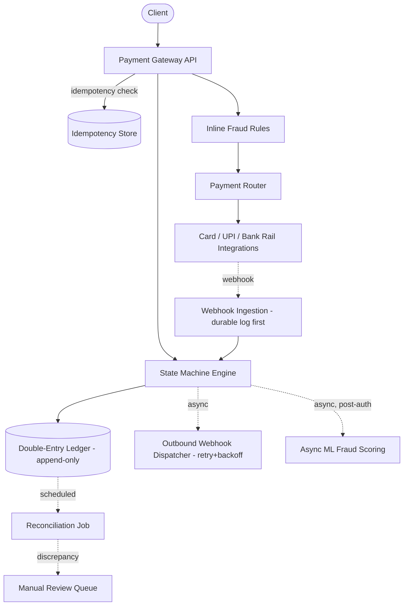

# Chapter 20: FinTech System Design Deep Dive

*← [Chapter 19: Company-Specific Prep](19-Company-Specific-Prep.md) · [Index](00-Index-and-Assessment.md) · Next → [Chapter 21: Real-Time System Design](21-Realtime-System-Design.md)*

*Given your explicit interest in Razorpay/PhonePe/CRED/Tabby/Tamara-tier companies, treat this chapter as required reading, not optional depth. It consolidates and extends the payment/wallet material from [Chapter 18, Problems 21–22](18-Problems-Advanced.md) with the specific mechanics — double-entry accounting, chargebacks, fraud, reconciliation — that separate a generic "add a payments service" answer from one that sounds like it came from someone who's actually thought about money movement correctness.*

---

## 20.1 Double-Entry Accounting — The Mechanics, Precisely

You met the *why* in Chapter 18.22 (balance is derived, never directly mutated). Here's the mechanical detail interviewers actually probe for.

**Every transaction is recorded as at least two balanced entries**, across two or more accounts: one **debit**, one **credit**, whose amounts are equal — this is what "double-entry" means, and it's not accounting formalism for its own sake, it's a built-in correctness check: **the sum of all debits must always equal the sum of all credits, system-wide, at all times.** If they don't, you have a bug or fraud, and you can detect it by simply summing — this single invariant is an extraordinarily cheap, powerful correctness check that a naive "just update a balance column" design gives up entirely.

**Worked example — a user tops up their wallet with ₹500 via a card:**

| Account | Debit | Credit |
|---|---|---|
| User's Wallet Account | | ₹500 |
| Payment Gateway Suspense Account | ₹500 | |

The "suspense account" represents money received from the card network but not yet settled/reconciled — a real intermediate state, not a simplification. When the payment gateway's settlement file later confirms the funds actually landed, a second entry moves it from suspense into a proper bank/cash account.

**Worked example — a P2P transfer of ₹200 from User A to User B:**

| Account | Debit | Credit |
|---|---|---|
| User A's Wallet | ₹200 | |
| User B's Wallet | | ₹200 |

**Why this belongs in a single ACID transaction:** both entries must commit together or not at all — this is exactly the case where a single-database transaction (Chapter 5.2) is sufficient and correct, and reaching for a cross-service Saga would be over-engineering *if* both wallets live in the same ledger service/database, which is a strong reason to design the ledger as one tightly-consistent internal service rather than splitting it prematurely (echoing Chapter 18.22's answer to exactly this).

> **Interview question:** "Why not just have a single `balance` column on the user table and `UPDATE balance = balance + amount`?"
> **Ideal senior answer:** "That works right up until something goes wrong — a bug, a retried request, a disputed transaction — and then you have no way to reconstruct *how* the balance got to its current value, or to prove to a regulator or an unhappy customer exactly what happened. A double-entry ledger of immutable entries means the balance is always a derived, auditable fact, not a trusted assertion — and the debits-equal-credits invariant gives you a cheap, continuous correctness check you simply don't get with a single mutable number. The operational cost is real — it's more rows, more complexity than one UPDATE — but for money, that cost is worth paying from day one, because retrofitting auditability after an incident is far more expensive than building it in up front."

---

## 20.2 The Payment State Machine

A payment (or any ledger-affecting operation) should move through an **explicit, enumerated set of states**, with only specific transitions allowed — this prevents the class of bug where a payment ends up in an ambiguous or contradictory status because different parts of the system updated it inconsistently.

**Why "Pending" is its own real state, not just a waiting spinner:** some payment rails (bank transfers, certain UPI flows, BNPL scheduled installments — relevant to Chapter 19's Tabby/Tamara note) don't resolve synchronously. The system must correctly represent "we genuinely don't know the final outcome yet" rather than forcing a premature Success/Failed guess — and the reconciliation job (Section 20.5) is specifically what resolves `Pending` transactions definitively over time.

**Enforce transitions at the data layer, not just in application code:** a transaction that's already `Refunded` should be structurally prevented from transitioning back to `Processing` — whether via a state-machine library, a database constraint, or careful transition-validation logic in the one service that owns this data — because relying on every caller to "remember" the valid transition rules is exactly the kind of distributed correctness assumption that breaks under real-world concurrency and bugs.

---

## 20.3 Refunds and Chargebacks — Not the Same Thing

This distinction is a genuine, checkable piece of domain knowledge worth having crisp:

| | Refund | Chargeback |
|---|---|---|
| Who initiates | The merchant (voluntarily, or per policy) | The customer's bank/card issuer, on the customer's dispute |
| Merchant's role | Merchant chooses to do it | Merchant can *contest* it, but doesn't control the outcome |
| System modeling | A new, linked transaction reversing the original (its own ledger entries, its own state machine, referencing the original transaction ID) | An externally-triggered event the system must *react* to — the payment gateway/processor notifies you a chargeback occurred, often well after the original transaction, and your system needs a workflow for merchant response/evidence submission, not just a data update |
| Financial impact beyond the amount | None inherently | Chargebacks typically carry an additional penalty fee from the card network, and a high chargeback rate can jeopardize a merchant's ability to process cards at all — a real business risk worth naming |

**Design implication:** refunds are triggered *within* your system (an internal API call), while chargebacks are triggered *by* an external event arriving asynchronously (a webhook or batch file from the processor) — your architecture needs an explicit ingestion path for chargeback notifications feeding into the same state-machine-and-ledger discipline as everything else, not a bolted-on special case.

---

## 20.4 Fraud Detection — Where It Fits Architecturally

You're not expected to design a full ML fraud model in an HLD interview, but you are expected to know **where fraud checks belong in the request flow and why**.

**Synchronous, low-latency checks** (rule-based — velocity checks like "more than 5 transactions from this card in 60 seconds," geolocation mismatches, amount thresholds) run **inline, before the payment is authorized** — these must be fast (a few milliseconds) since they're on the critical checkout path, which constrains them to simple, cheap rules or a pre-computed risk score lookup rather than a heavy real-time model.

**Asynchronous, deeper analysis** (ML-scored risk models considering broader behavioral history, cross-transaction patterns) runs **after** authorization, potentially flagging a transaction for review or triggering a hold/reversal shortly after the fact — this is the same "cheap-fast-filter, then expensive-precise-analysis" two-stage pattern from Chapter 18's matching/ranking problems, applied to risk scoring instead.

> **Interview question:** "Where would you place fraud detection in a payment flow, and why not run the full ML model synchronously before every payment?"
> **Ideal senior answer:** "I'd split it: a fast, cheap rule-based check inline before authorization — catching obvious abuse patterns in a few milliseconds without adding meaningful latency to checkout — and a heavier, asynchronous ML-based risk scoring pass after authorization, which can flag a transaction for hold, manual review, or automatic reversal if it's scored high-risk, without the customer waiting on that heavier computation during checkout. Running the full model synchronously would either blow the checkout latency budget or force the model to be too simplified to be useful — this two-stage approach is the same fast-filter-then-precise-score pattern that shows up in ranking and matching systems generally."

---

## 20.5 Reconciliation — The Unglamorous, Genuinely High-Signal Topic

**The problem:** your system's internal record of "this payment succeeded" and the payment processor's / bank's actual record can, in the real world, drift apart — a webhook gets lost, a network call times out after the charge actually succeeded (Chapter 6.1's core uncertainty, applied directly), a `Pending` transaction needs eventual resolution.

**The solution:** a scheduled **reconciliation job** that periodically fetches the processor's/bank's own settlement file or transaction-status API (most payment processors provide exactly this, precisely because this problem is universal across the industry) and compares it, transaction by transaction, against your internal ledger — flagging and resolving discrepancies (a transaction you think failed but the processor says succeeded, or vice versa) automatically where the resolution is unambiguous, and routing genuinely ambiguous cases to a manual review queue.

**Why this is architecturally distinct from real-time processing, not just "more of the same":** reconciliation is inherently a **batch, offline, eventually-consistent** process — it doesn't need to run in real time, and trying to make it real-time would be solving the wrong problem (Section 20.2's `Pending` state already handles the real-time uncertainty; reconciliation is the backstop that resolves it definitively, on its own schedule, typically daily or a few times a day matching the processor's own settlement cadence).

> **Interview question (this is one of PhonePe's actual reported question areas — see Chapter 19):** "Design a reconciliation system comparing your internal ledger against a bank's settlement file."
> **Ideal senior answer:** "I'd ingest the bank's settlement file (typically a batch file delivered daily) and match each entry against my internal ledger by a shared reference ID — most will match cleanly and need no action. For mismatches, I'd categorize them: transactions in my ledger but not in the settlement file yet (likely still `Pending`, needing another cycle before escalating), transactions in the settlement file but not reflected correctly in my ledger (a real discrepancy — possibly a lost webhook, needing an automatic correction with a full audit trail of the correction itself, since silently editing financial records without a trail would defeat the entire point of the ledger), and genuinely ambiguous cases routed to a manual review queue rather than auto-resolved. I'd track a reconciliation-match-rate metric and alert if it drops below a threshold, since a sudden increase in mismatches is itself a strong signal something's wrong upstream — a webhook delivery outage, for instance."

---

## 20.6 Webhooks — Reliable Delivery, Not Just "POST and Hope"

Payment status changes often need to notify external systems (a merchant's backend, in Razorpay/Stripe's model) asynchronously — via webhooks. Doing this reliably is a real design point:

- **At-least-once delivery with retries and backoff** (Chapter 6.2) — the receiving merchant's endpoint might be briefly down; retry with exponential backoff over a bounded window (commonly up to 24 hours across several attempts) before giving up and requiring the merchant to poll a status API as a fallback.
- **Idempotency on the receiving end, by design** — since retries mean the merchant might receive the same webhook more than once, every webhook payload should include a unique event ID, and well-designed merchant integrations (and well-designed webhook *senders*, who should document this clearly) treat duplicate event IDs as safe no-ops — this is the idempotency-key pattern (Chapter 6.4) applied at the receiving end of an async notification, not just the request-response API layer.
- **Signature verification** — every webhook payload should be signed (typically HMAC with a shared secret) so the receiver can verify it genuinely came from the payment provider and wasn't spoofed — a real, specific security requirement worth naming for this exact mechanism.
- **The durable-log-first principle from Chapter 18.21** applies again here: process a received webhook by first durably recording the raw event, then processing it — so a crash mid-processing can safely resume from the stored event rather than losing it or double-processing it ambiguously.

---

## 20.7 Putting It Together — A Complete FinTech Reference Architecture

This diagram is worth being able to reproduce from memory — it's the synthesis of everything in this chapter plus Chapter 18, Problems 21–22, and it directly addresses the reported question shapes from Razorpay and PhonePe in Chapter 19.

---

## Chapter 20 Interview Drill

1. Explain double-entry accounting with a worked P2P transfer example, including why it's a single ACID transaction rather than a Saga.
2. Walk through the full payment state machine, including why `Pending` is a real, necessary state.
3. Precisely distinguish a refund from a chargeback, including who initiates each and how that changes the system design.
4. Explain the two-stage (inline rules + async ML) fraud detection placement, and why the full model can't run synchronously.
5. Design the reconciliation job end to end — ingestion, matching, discrepancy handling, alerting.
6. Explain why webhook delivery needs both retry/backoff on the sender side and idempotent handling on the receiver side.

---

*Next → [Chapter 21: Real-Time System Design](21-Realtime-System-Design.md) — WebSockets, SSE, presence, live location tracking, and scaling strategies for real-time features.*
