# Chapter 29: Evaluation Rubric & The Final "Design Any Product" Framework

*← [Chapter 28: Mock Interviews](28-Mock-Interviews.md) · [Index](00-Index-and-Assessment.md) · Next → [Back to Index](00-Index-and-Assessment.md)*

---

## 29.1 The 100-Point Evaluation Rubric

Use this to self-score every mock interview from [Chapter 28](28-Mock-Interviews.md), or have a study partner score you. Be honest — an inflated self-score is the one thing that will actually hurt you here, since the entire point is finding real gaps before a real interviewer does.

| Category | Points | What earns full marks |
|---|---|---|
| **Requirement clarification** | 10 | Asked scoped, sharp clarifying questions (not generic ones) within the first 5 minutes; correctly identified FR vs. NFR; didn't over-ask (more than ~6 questions starts costing points for pacing) |
| **Capacity estimation** | 10 | Did the DAU→RPS→peak→storage math out loud, rounded sensibly, and — critically — used the numbers to justify at least one later architecture decision, rather than treating it as a disconnected ritual |
| **Architecture** | 15 | Clean, incremental, correctly-labeled diagram (Chapter 15's notation); logical component boundaries; sync vs. async correctly distinguished visually |
| **Data model** | 10 | Right database category chosen with a stated reason (Chapter 4.6's framework); key entities and relationships correctly identified; no missed obvious entity |
| **API design** | 5 | RESTful/appropriate method+path conventions; pagination handled if relevant; idempotency mentioned for unsafe writes where relevant |
| **Scalability** | 15 | Correctly identifies what needs to scale and why; uses the DB scaling ladder in the right order; doesn't over- or under-engineer relative to the stated scale |
| **Reliability** | 10 | Timeouts/retries/circuit breakers mentioned where genuinely relevant; replication/failover addressed; RPO/RTO discussed if disaster recovery comes up |
| **Consistency** | 5 | States a consistency model per data type (not one blanket answer); correctly applies CAP/PACELC reasoning where it matters |
| **Security** | 5 | At least 1–2 concrete, relevant security decisions raised unprompted (not generically bolted on at the very end) |
| **Observability** | 5 | Logging/metrics/tracing mentioned with enough specificity to show real operational thinking, not just a buzzword drop |
| **Trade-offs** | 5 | Explicitly names at least 2–3 real trade-offs made during the session, unprompted |
| **Communication** | 5 | Thinks aloud clearly, invites the interviewer in (Chapter 14.1's Step 6 framing), handles a challenge without becoming defensive (Chapter 14.2) |
| **Total** | **100** | |

### Readiness Bands

| Score | Band | What it means |
|---|---|---|
| **0–40** | Not ready | Fundamentals still shaky — go back to [Chapters 1–8](01-Prerequisites-Networking.md) before attempting more mocks; more mock volume won't help until the base concepts are solid |
| **40–60** | Beginner | Core concepts present but thin — likely missing capacity estimation discipline, trade-off articulation, or failure handling; focus revision on whichever rubric categories scored lowest, not a general re-read |
| **60–75** | Intermediate | Solid, structurally correct designs — the gap to close is usually depth on deep-dives and unprompted trade-off/security/observability mentions; this is a reasonable bar for Tier-2 product companies |
| **75–85** | Senior interview ready | Consistently strong across all categories, handles challenges well — this is your target band for the companies in [Chapter 19](19-Company-Specific-Prep.md)'s India/UAE list, and a real, crackable bar for many Tier-1 mid-senior loops too |
| **85–95** | Tier-1 ready | Staff-level trade-off and business-context reasoning ([Chapter 14.3](14-Interview-Framework-Communication.md)) showing up consistently, not just occasionally; ready for Amazon/Google/Meta-caliber senior loops |
| **95+** | Excellent | Rare in practice — treat consistently scoring here as a signal to spend remaining prep time on breadth (more unfamiliar problems) rather than more depth on problems you've already mastered |

**A calibration note on these thresholds:** they're deliberately conservative relative to some public rubrics, reflecting that real interviewers weight unprompted trade-off articulation and failure-handling more heavily than raw technical correctness once you're past the "does this design basically work" bar — which matches everything in [Chapter 14](14-Interview-Framework-Communication.md) about what actually separates candidates in practice.

---

## 29.2 The Final "Design Any Product" Framework

When an interviewer says "design X" and X is something you've never specifically studied, here is the exact sequence to run — memorize this page, not the 30 worked problems.

```mermaid
flowchart TD
    A[Interviewer says: Design X] --> B[1. Clarify: what does X actually do, for whom, at what scale]
    B --> C[2. Identify the users and core workflows]
    C --> D[3. Estimate scale: DAU, RPS, peak, storage]
    D --> E[4. Define 4-6 core APIs]
    E --> F[5. Define the data model and pick DB category]
    F --> G[6. Draw high-level architecture, narrating as you build it]
    G --> H[7. Identify likely bottlenecks given the numbers from step 3]
    H --> I{Does a bottleneck need a cache?}
    I -->|Yes| I1[Add cache-aside, state TTL + eviction]
    I -->|No| J
    I1 --> J{Does anything need decoupling from the request path?}
    J -->|Yes| J1[Add a queue, state what it decouples and why]
    J -->|No| K
    J1 --> K{Will one DB instance hit a ceiling?}
    K -->|Yes, evidenced by step 3's numbers| K1[Read replica to shard to distributed DB, in that order]
    K -->|No| L
    K1 --> L[8. State the consistency model per data type]
    L --> M[9. Add reliability: timeouts, retries, circuit breakers, replication]
    M --> N[10. Weave in security: auth, encryption, rate limiting]
    N --> O[11. Weave in observability: logs, metrics, traces]
    O --> P[12. State 2-3 explicit trade-offs made along the way]
    P --> Q[13. Note future scaling direction if time remains]
    Q --> R[Done — invite challenge questions and defend calmly]
```

**The one-sentence version to internalize:** *clarify → identify users and workflows → estimate → API → data model → architecture (narrated) → bottlenecks → cache/queue/scale as evidenced by the numbers → consistency per data type → reliability → security → observability → trade-offs → future scaling.* This is the same 10-step framework from [Chapter 14.1](14-Interview-Framework-Communication.md), expanded with the two workflow-identification steps at the front that matter most for a genuinely unfamiliar product.

**Why "identify users and workflows" deserves its own explicit step for unfamiliar products specifically:** for a well-known product (Twitter, Uber), the core workflows are obvious and you can move straight to estimation. For something you've genuinely never considered — "design a system for matching blood donors to hospitals in real time," say — spending 2 focused minutes explicitly listing *who* uses this (donors, hospitals, coordinators) and *what they each need to do* is what lets you derive the rest of the design logically instead of freezing. This is the literal mechanism behind this roadmap's stated philosophy: **understand → visualize → implement mentally → design → explain → defend → optimize**, applied to a problem you're seeing for the first time, in real time, under pressure — which is the actual skill every other chapter in this roadmap has been building toward.

---

## 29.3 Final Readiness Checklist

Before a real interview, confirm every box below is genuinely, honestly checked — not "I read the chapter once."

- [ ] I can run the 10-step framework on a cold, unfamiliar prompt, alone, in 45 minutes, without notes.
- [ ] I can do back-of-envelope capacity estimation for any product in under 5 minutes.
- [ ] I can draw all four diagram flow types cleanly and quickly by hand.
- [ ] I can explain CAP/PACELC, consistent hashing, idempotency, and the Saga pattern from memory, precisely.
- [ ] I can explain double-entry ledger accounting and walk through a P2P transfer at the data level.
- [ ] I have scored 75+ on at least 3 mocks from the Senior tier ([Chapter 28](28-Mock-Interviews.md)).
- [ ] I have scored 75+ on at least 2 mocks from the Tier-1 tier.
- [ ] I can name 2–3 specific, reported interview patterns for each of my top 3 target companies ([Chapter 19](19-Company-Specific-Prep.md)).
- [ ] I can handle a direct challenge to my design without becoming defensive, using the validate-then-justify-the-exception pattern ([Chapter 14.2](14-Interview-Framework-Communication.md)).
- [ ] I've reviewed the [cheat sheet](26-Cheat-Sheet-Decision-Matrices.md) within the last 3 days.
- [ ] I know my 3 weakest topics right now, and I've deliberately practiced them in the last week, not avoided them.

When every box is checked, honestly, you are ready. Go get it.

---

*This is the final chapter of the roadmap's core content. Return to the [Index](00-Index-and-Assessment.md) for the full table of contents, or revisit the [Cheat Sheet](26-Cheat-Sheet-Decision-Matrices.md) for pre-interview revision.*
